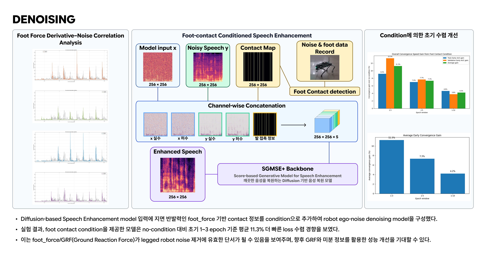
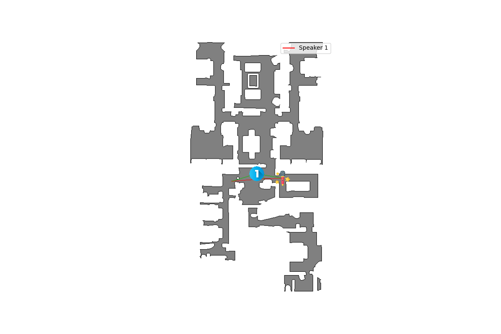
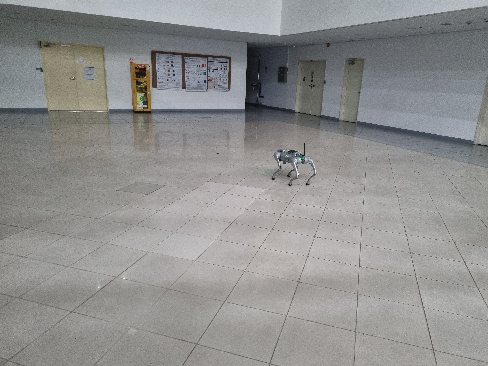
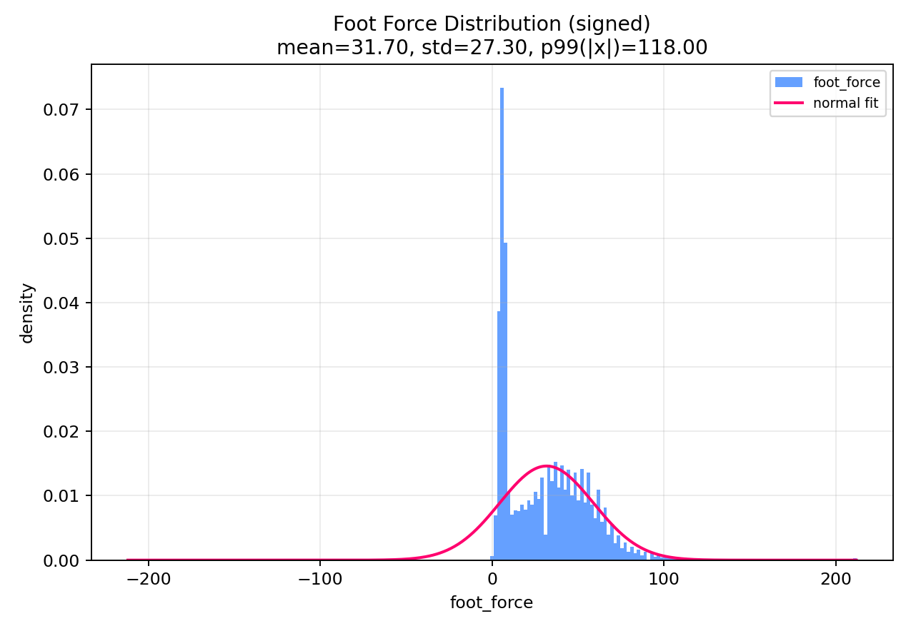

# LRDSE

> 4족 보행 로봇의 주행 소음 환경에서 로봇 센서 정보를 활용해 음성을 복원하는 Robot-Aware Speech Enhancement 프로젝트입니다.

## 1. 소개

LRDSE는 로봇 주행 중 발생하는 foot contact, 발 충격, 관절 움직임 기반 소음이 음성 신호에 섞이는 상황을 다룹니다. 일반적인 speech enhancement 모델은 noisy speech만 입력으로 사용하지만, 본 프로젝트는 robot foot force / contact condition을 함께 사용하여 로봇 소음에 더 강한 음성 복원을 목표로 합니다.

기본 학습 경로는 `train_sgmse.py`의 SGMSE 기반 모델입니다. Clean speech와 quadruped robot noise가 섞인 noisy speech를 paired manifest로 학습하며, noisy sample 폴더에 robot `anchor` / `lowstate` 파일이 있으면 foot force 기반 auxiliary condition도 함께 사용할 수 있습니다.

<p align="center">
  <a href="./assets/readme/poster.jpg">
    
  </a>
</p>

## 2. 사용법 및 폴더 소개

사용하는 환경에 맞춰 주요 패키지를 설치합니다. CUDA를 사용할 경우 PyTorch는 로컬 CUDA 버전에 맞는 wheel로 설치해야 합니다.

```bash
cd /home/jaewoo/MAIR/ryu/robot_denoising/2026-capstone-43/LRDSE
python3 -m pip install torch torchaudio numpy scipy soundfile matplotlib
```

### 학습 데이터 전제

`data/` 아래의 음성 데이터와 로봇 로그는 용량이 커서 저장소에 포함하지 않았습니다. 아래 학습 명령은 `data/manifest_train.csv`와 `data/manifest_val.csv`가 이미 준비되어 있다고 가정합니다.

`manifest`에는 최소한 아래 정보가 필요합니다.

- `noisy_wav`: noisy speech wav/flac 경로
- `clean_wav`: clean speech wav/flac 경로
- `valid`: 학습에 사용할 row 여부
- `speaker_id`, `book_id`, `source_id`: split과 sample 식별용 정보

Condition 학습을 사용하려면 `noisy_wav`가 들어 있는 sample 폴더에 robot state segment 파일도 함께 있어야 합니다.

```text
<sample_dir>/
├── <source_id>.wav
├── anchor_segment.json
├── lowstate_segment.jsonl
├── highstate_segment.jsonl
└── segment_meta.json
```

### 학습

```bash
# 기본 SGMSE 학습
python3 train_sgmse.py \
  --manifest ./data/manifest_train.csv \
  --val-manifest ./data/manifest_val.csv \
  --save-dir ./checkpoints/sgmse_se \
  --device cuda \
  --batch-size 4 \
  --max-epochs 300
```

```bash
# Foot contact condition을 사용하는 학습
python3 train_sgmse.py \
  --manifest ./data/manifest_train.csv \
  --val-manifest ./data/manifest_val.csv \
  --save-dir ./checkpoints/sgmse_temp_contact \
  --device cuda \
  --batch-size 4 \
  --num-workers 2 \
  --lr 1e-4 \
  --max-epochs 300 \
  --use-temp-condition
```

### 추론

```bash
python3 denoise_sgmse.py \
  --checkpoint ./checkpoints/sgmse_se/latest.pt \
  --noisy-wav /path/to/noisy.wav \
  --out ./outputs/denoise_sgmse/noisy_enhanced.wav \
  --device cuda
```

폴더 구조:

```text
LRDSE/
├── train_sgmse.py              # SGMSE speech enhancement 학습 / 검증 / 샘플 저장
├── denoise_sgmse.py            # 학습된 SGMSE checkpoint로 noisy wav denoising
├── train_condition_encoder.py  # foot force 기반 condition encoder 실험
├── train_rddm.py               # RDDM 실험 코드
├── dataset.py                  # paired clean/noisy dataset, condition 로딩
├── src/
│   ├── audio/preprocess.py     # wav crop, STFT, spec transform, inverse transform
│   ├── check/                  # dataset/model/condition sanity check 유틸
│   ├── condition/preprocess.py # foot force / contact condition token 생성
│   ├── models/                 # SGMSE / RDDM / condition encoder model wrapper
│   ├── plot/                   # STFT/loss/condition 시각화 유틸
│   └── prepare/                # manifest / noisy data 생성 유틸
├── assets/readme/              # README 시각 자료
├── data/                       # manifest 및 noisy sample, 원본 데이터는 용량 문제로 미포함
├── checkpoints/                # 학습 checkpoint 저장 위치
└── outputs/                    # debug/plot output 저장 위치
```

## 3. 연구 내용

### 3.1 Dataset 구성

Speech dataset은 SonicSim의 데이터 생성 코드를 일부 변형하여 구성했습니다. 데이터 생성 시 microphone과 speech source 사이의 LOS(Line-of-Sight)가 유지되도록 하여, 벽이나 장애물에 의해 직접 경로가 가려지는 상황을 제외하고 로봇 소음에 의한 음성 저하에 집중할 수 있도록 했습니다.

<p align="center">
  
</p>

위 그림에서는 speech source의 위치, microphone의 위치, 그리고 microphone의 이동 경로를 확인할 수 있습니다. 실제 로봇이 움직이는 상황에서는 source와 microphone의 상대 위치가 계속 변하므로 RIR(Room Impulse Response)도 시간에 따라 달라집니다. 따라서 고정된 RIR을 사용하는 대신 SonicSim을 통해 moving RIR 기반 음성을 생성하여 더 자연스러운 음성 데이터를 만들었습니다.

<p align="center">
  
</p>

Robot noise와 foot data는 Go2를 직접 구동하면서 녹음했습니다. 이때 robot noise audio와 foot force / state log가 같은 시간축에서 해석될 수 있도록 time sync를 맞춰 기록했습니다. 최종 dataset은 SonicSim으로 생성한 moving RIR 기반 speech에 Go2에서 기록한 robot noise를 혼합하고, 같은 시간 구간의 foot force log를 condition으로 연결하여 구성했습니다.

### 3.2 Robot Condition 분석

Robot noise와 직접적으로 관련된 foot force 정보를 condition으로 사용할 수 있는지 확인하기 위해, 먼저 foot force와 robot noise의 관계를 분석했습니다.

아래 그림은 각 발 센서 값이 시간에 따라 변하는 정도, 즉 foot force 미분값의 절대값과 noise waveform을 같은 시간축에 겹쳐 비교한 결과입니다. Noise의 peak가 나타나는 순간에 발에 가해지는 압력 변화 또한 peak를 보이는 양상이 나타났고, 이를 통해 foot force와 robot noise가 높은 상관 관계를 가진다는 점을 확인할 수 있습니다.

<p align="center">
  
</p>

### 3.3 전처리 과정

전처리는 robot foot force 정보를 speech enhancement 모델에 넣을 수 있는 condition channel로 변환하고, 이를 audio frame과 정렬하는 과정입니다.

```text
Clean Speech + Robot Noise
        ↓
Noisy Speech
        +
Foot Force / Contact Signal
        ↓
SGMSE-based Speech Enhancement
```

전처리 과정은 다음 순서로 진행됩니다.

1. `lowstate_segment.jsonl`에서 네 발의 `foot_force` 값을 읽습니다.
2. `anchor_segment.json`과 `segment_meta.json`을 사용해 robot log의 `CLOCK_MONOTONIC` 시간축을 audio sample 시간축과 맞춥니다.
3. Audio frame 구간마다 각 발의 force 값을 확인합니다.
4. Foot force distribution을 분석해 contact 여부를 판단할 기준을 정합니다.
5. 변환된 4개 foot contact channel을 SGMSE 입력에 auxiliary condition으로 붙입니다.

기본 audio preprocess 설정은 16 kHz mono 기준입니다. 학습에서는 waveform을 고정 길이로 crop/pad하고, 같은 crop 구간에 맞춰 robot condition도 함께 잘라 정렬합니다.

- `target_sr=16000`
- `n_fft=510`
- `win_length=510`
- `hop_length=128`
- `num_frames=256`
- `target_length=(num_frames - 1) * hop_length = 32640`

아래 그림은 foot force 값의 distribution을 확인한 결과입니다. 0에 가까운 값들이 만드는 큰 peak는 로봇의 발이 공중에 떠 있어 지면 압력이 거의 없는 구간이라고 가정했습니다. 따라서 이 peak가 끝나는 값을 기준으로 발이 지면에 닿았는지 여부를 나누고, 이를 contact condition으로 변환했습니다.

<p align="center">
  
</p>

## 4. 결과

아래 결과는 random seed를 바꿔가며 condition model과 no-condition model을 각각 5회 학습했을 때의 loss 수렴 양상을 비교한 것입니다.

<p align="center">
  
</p>

<p align="center">
  
</p>

실험 결과, 단순 contact condition을 추가했을 때 loss 수렴 양상에서 condition 사용 여부에 따른 뚜렷한 품질 차이는 확인되지 않았습니다. 또한 충분한 학습을 진행한 경우, 200 epoch 기준으로 condition model과 no-condition model의 복원 품질에는 큰 차이가 없었습니다.

이는 현재 사용한 condition이 foot contact 여부만을 단순하게 전달하기 때문에, 로봇 소음의 세기나 동역학적 변화를 충분히 표현하지 못했을 가능성을 보여줍니다. 따라서 단순 contact 결과가 아니라 foot force 값을 더 정교하게 전처리하여 condition으로 전달한다면, 로봇 소음 패턴을 더 잘 반영하고 speech enhancement 성능을 개선할 수 있을 것으로 기대합니다.

### Audio Samples

아래 sample은 약 17초 길이의 같은 utterance에 대해 noisy input, condition 기반 enhanced output, clean reference를 비교한 것입니다. GitHub README에서는 audio player가 직접 렌더링되지 않을 수 있으므로, wav 파일 링크를 클릭해 재생하거나 다운로드해서 비교합니다.

| Type | Audio |
|---|---|
| Noisy input | [sample_noisy.wav](./assets/readme/audio/sample_noisy.wav) |
| Enhanced output | [sample_enhanced_condition.wav](./assets/readme/audio/sample_enhanced_condition.wav) |
| Clean reference | [sample_clean.wav](./assets/readme/audio/sample_clean.wav) |
