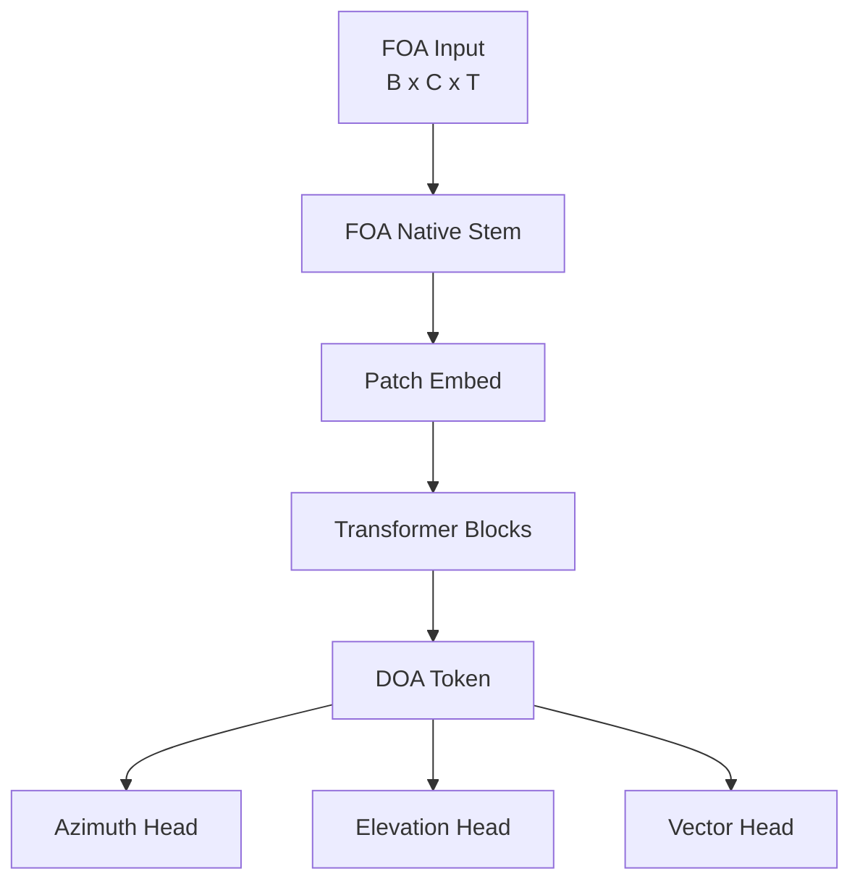

# 03_spatialast_FOA 아키텍처

## 목적
- FOA(`WXYZ + IV`) 입력 기반 방위각/고도/벡터 예측

## 다이어그램(작성 템플릿)

```mermaid
flowchart TD
    A[FOA Input<br/>B x C x T] --> B[FOA Native Stem]
    B --> C[Patch Embed]
    C --> D[Transformer Blocks]
    D --> E[DOA Token]
    E --> F1[Azimuth Head]
    E --> F2[Elevation Head]
    E --> F3[Vector Head]
```

## 메모
- 채널 정규화 규칙:
- loss 연결 지점:
