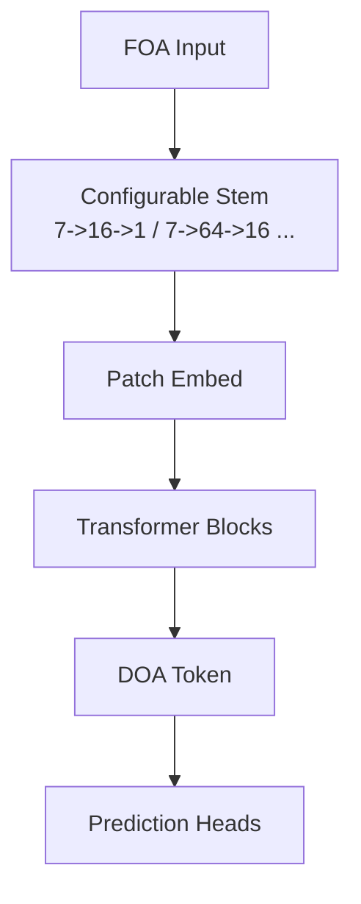

# 04_spatialast_FOA_conv 아키텍처

## 목적
- FOA stem 폭(채널 수) 변화에 따른 성능 비교

## 다이어그램(작성 템플릿)

```mermaid
flowchart TD
    A[FOA Input] --> B[Configurable Stem<br/>7->16->1 / 7->64->16 ...]
    B --> C[Patch Embed]
    C --> D[Transformer Blocks]
    D --> E[DOA Token]
    E --> F[Prediction Heads]
```

## 메모
- 사용한 stem variant:
- best variant:
