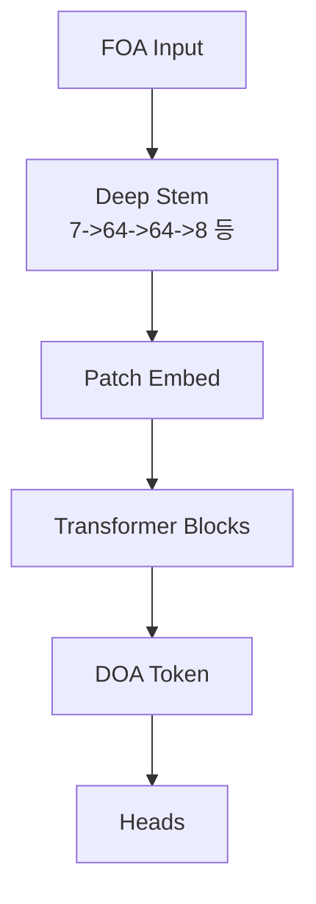

# 05_spatialast_FOA_conv64x2 아키텍처

## 목적
- stem 깊이(2~3 stage) 확장에 따른 공간 단서 보존 효과 검증

## 다이어그램(작성 템플릿)

```mermaid
flowchart TD
    A[FOA Input] --> B[Deep Stem<br/>7->64->64->8 등]
    B --> C[Patch Embed]
    C --> D[Transformer Blocks]
    D --> E[DOA Token]
    E --> F[Heads]
```

## 메모
- depth variant:
- 실험 stage:
