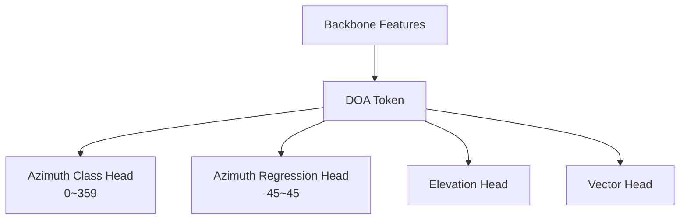

# 06_spatialast_FOA_frontreg 아키텍처

## 목적
- 방위각 supervision을 `360-class` vs `front-cone regression`으로 비교

## 다이어그램(작성 템플릿)

```mermaid
flowchart TD
    A[Backbone Features] --> B[DOA Token]
    B --> C1[Azimuth Class Head<br/>0~359]
    B --> C2[Azimuth Regression Head<br/>-45~45]
    B --> C3[Elevation Head]
    B --> C4[Vector Head]
```

## 메모
- azimuth mode:
- metric:
