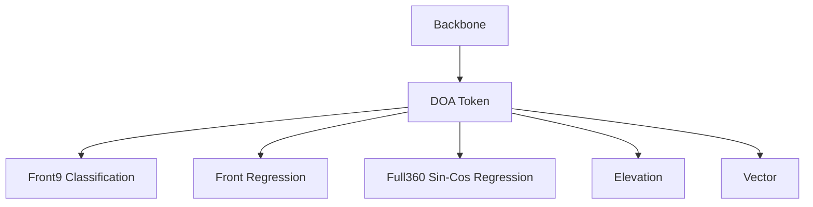

# 07_spatialast_FOA_front9_and_reg 아키텍처

## 목적
- front9 분류 / front 회귀 / full360 sin-cos 회귀를 통합 비교

## 다이어그램(작성 템플릿)

```mermaid
flowchart TD
    A[Backbone] --> B[DOA Token]
    B --> C1[Front9 Classification]
    B --> C2[Front Regression]
    B --> C3[Full360 Sin-Cos Regression]
    B --> C4[Elevation]
    B --> C5[Vector]
```

## 메모
- active mode:
- staged training setting:
