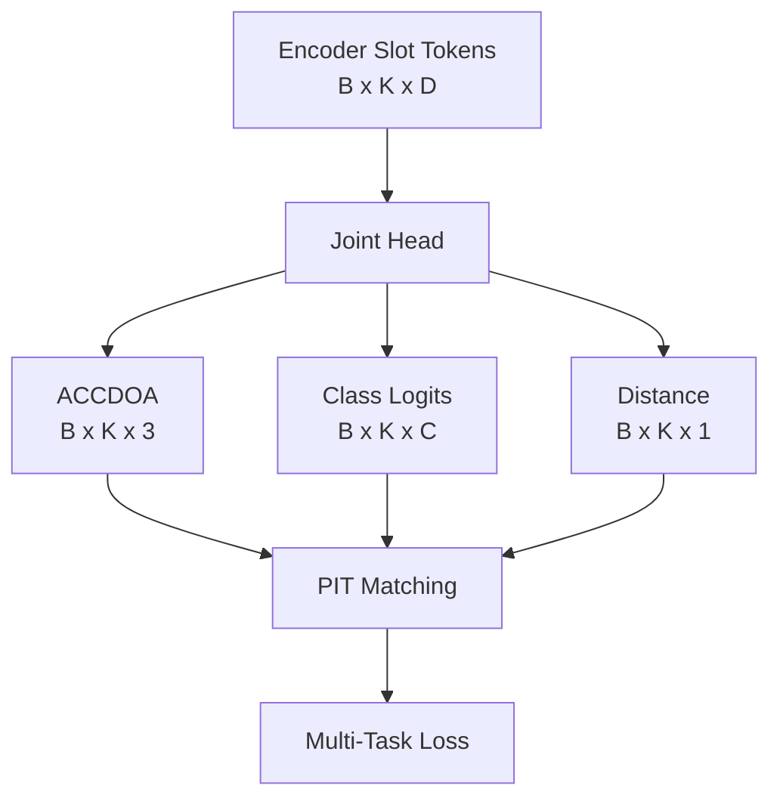

# 08_multi_accdoa_head 아키텍처

## 목적
- Multi-source slot 기반 ACCDOA + class + distance 동시 예측

## 다이어그램(작성 템플릿)

```mermaid
flowchart TD
    A[Encoder Slot Tokens<br/>B x K x D] --> B[Joint Head]
    B --> C1[ACCDOA<br/>B x K x 3]
    B --> C2[Class Logits<br/>B x K x C]
    B --> C3[Distance<br/>B x K x 1]
    C1 --> D[PIT Matching]
    C2 --> D
    C3 --> D
    D --> E[Multi-Task Loss]
```

## 메모
- Kmax:
- inactive slot policy:
