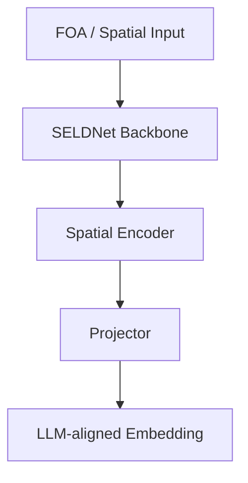

# 15_sciphi (Sci-Phi) 아키텍처

## 목적
- FOA 기반 spatial encoder를 LLM 파이프라인에 연결하기 위한 branch 구조 문서화

## 코드 위치
- `../15_sciphi_baselines/Sci-Phi/spatial_branch`

## 다이어그램(작성 템플릿)

## 메모
- 핵심 파일:
- 입력 feature 정의:
