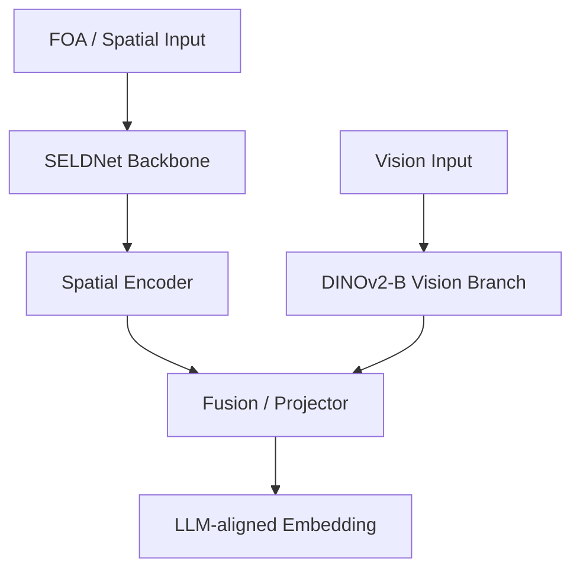

# 15_sciphi_dinov2_b (Sci-Phi-DINOv2-B) 아키텍처

## 목적
- Sci-Phi branch에 DINOv2-B 기반 시각 인코딩 경로가 결합된 변형 구조 문서화

## 코드 위치
- `../15_sciphi_baselines/Sci-Phi-DINOv2-B/spatial_branch`

## 다이어그램(작성 템플릿)

## 메모
- vision branch 파일:
- fusion 방식:
