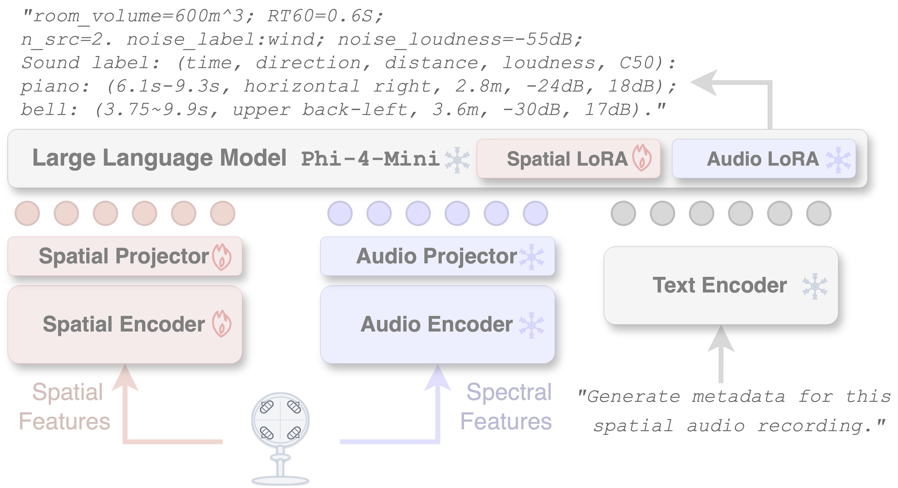
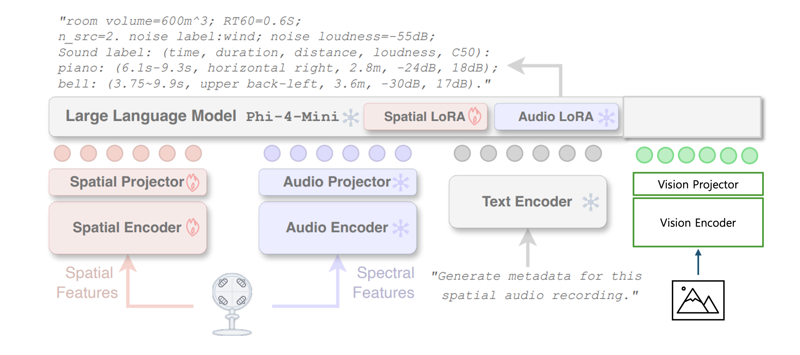
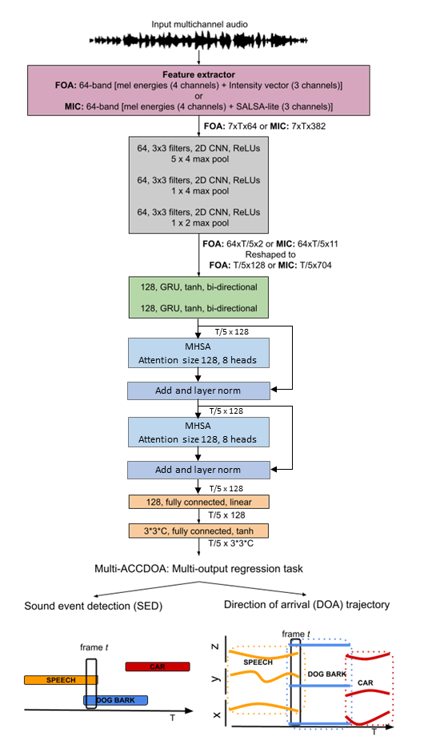
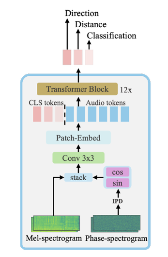

# SpatialAudio

> 본 저장소는 **“로봇을 위한 실세계 강인한 멀티모달 시공간 인지 기반의 전역적 동적 환경 인식 원천기술 개발”** 과제에서  
> **오디오 인지/학습 파이프라인**을 담당하는 연구·개발 코드베이스입니다.

---

## 프로젝트 포지셔닝

`SpatialAudio`는 다음을 목표로 합니다.

1. 실환경에서 강인한 방향/공간 음향 단서(FOA, AmbiX) 추출
2. 로봇 관점의 기하·가시성 맥락(LOS/NLOS, FOV)과 결합 가능한 학습 데이터 구축
3. `V_sphere`(vision)와 정합 가능한 `A_sphere`(audio) 표현 정의
4. SpatialAST 계열 모델 및 ACCDOA 계열 헤드 실험을 통한 성능 고도화

---

## Baseline

SpatialAudio 연구 방향을 설정하기 위한 대표 baseline 논문 3편을 아래와 같이 정리합니다.

| 모델 | 핵심 주제 |  |
| --- | --- | --- |
| **BAT (ICML 2024)** | 공간음향 인지 + LLM 추론 결합 | Spatial-AST/QA 태스크 설계 방향 |
| **Sci-Phi (ICASSP 2026)** | FOA 기반 공간 장면 기술(Description) | FOA 입력 표현과 다중 소스 파라미터 기술 |
| **Hear you are (CVPR 2026\*)** | 시각+공간음향 멀티모달 공간 추론 | `V_sphere`-`A_sphere` 정합 추론 태스크 |

### 1) BAT: Learning to Reason about Spatial Sounds with Large Language Models (ICML 2024)
- **문제 설정**: 기존 오디오 모델은 sound event detection/localization 중심이고, “공간 관계를 언어로 추론”하는 능력이 약함.
- **핵심 아이디어**:
  - 공간음향 인코더(Spatial-AST) + LLM(LLaMA-2 7B) 결합
  - Spatial sound 기반 QA 태스크로 추론 능력 학습
- **주요 기여**:
  - SpatialSoundQA 데이터셋 제안
  - SELD를 넘어 “소리 간 관계(reasoning)” 문제로 확장
- **In Ours**:
  - `03~07_spatialast_*` 실험에서 **공간 추론형 평가셋**을 별도로 구성할 필요
  - 분류/회귀 성능 외에 **언어 질의응답형 지표**를 추후 확장 가능

### 2) Sci-Phi: A Large Language Model Spatial Audio Descriptor (ICASSP 2026)

- **문제 설정**: 단일 채널 중심 오디오 LLM은 방향/거리/잔향 등 공간 파라미터 기술이 제한적임.
- **핵심 아이디어**:
  - spatial encoder + spectral encoder의 dual 구성
  - FOA 기반 다중 소스 장면을 한 번에 기술하도록 설계
- **주요 기여**:
  - 4,000시간 이상 합성 FOA 데이터 학습
  - 최대 4개 방향성 소스 + 배경음 + 실내 음향 특성(잔향 등) 동시 기술
  - permutation-invariant 평가 프로토콜과 다중 지표 설계
- **In Ours**:
  - `10_spherical_audio`의 구면 특징을 **장면 기술형 출력**으로 확장하는 방향과 정합
  - `08_multi_accdoa_head`와 결합 시, “슬롯별 기술(설명)” 태스크 설계 가능

### 3) Hear you are: Teaching LLMs Spatial Reasoning with Vision and Spatial Sound (CVPR 2026)

- **문제 설정**: 단순 audio-visual 정합(semantic/temporal correspondence)만으로는 공간 추론이 어려움.
- **핵심 아이디어**:
  - 공간음향 + 시각 정보를 LLM에 결합
  - 의미적으로 모호한 상황에서 공간 단서로 정답을 분리하는 QA 태스크 구성
- **주요 기여**:
  - Audio-Visual Spatial Reasoning 데이터셋/태스크 정의
  - 다중 후보 중 **공간 정합성**으로 정답 선택하는 추론 능력 검증
- **In Ours**:
  - `09_spherical_vision`과 `10_spherical_audio`를 결합한 **멀티모달 공간 추론 벤치마크** 설계에 직접적 근거 제공
  - 향후 scene-level reasoning에서 `sceneupdate`/scene graph 계열과의 인터페이스 확장 가능

### Baseline 비교 요약

- **BAT**: “공간음향 + LLM”의 출발점(추론 가능성 증명)
- **Sci-Phi**: “FOA 기반 장면 파라미터 기술”의 확장판(기술 능력 강화)
- **Hear you are**: “시각+공간음향 융합 추론”의 멀티모달 단계

즉, SpatialAudio는 위 3편을 따라  
**(1) 오디오 단일모달 추론 → (2) FOA 장면 기술 고도화 → (3) AV 공간추론 통합**의 로드맵으로 정렬할 수 있습니다.

참고 링크:

- BAT (ICML 2024): https://icml.cc/virtual/2024/poster/33244
- Sci-Phi (MSR 페이지): https://www.microsoft.com/en-us/research/publication/sci-phi-a-large-language-model-spatial-audio-descriptor/
- Hear you are (OpenReview): https://openreview.net/forum?id=b6s1jIHj6o

---

## 리포지토리 맵

| 디렉토리 | 분류 | 역할 |
| --- | --- | --- |
| `01_l3das` | 데이터 생성·검증 | HM3D 기반 단일 소스 공간음향 데이터셋 생성 |
| `02_pipeline` | 데이터 생성·검증 | 샘플 단위 진단 시각화(RGB/Depth/PointCloud/Beam/IV) |
| `03_spatialast_FOA` | 오디오 모델링(SpatialAST 계열) | FOA 기본 학습 베이스라인 |
| `04_spatialast_FOA_conv` | 오디오 모델링(SpatialAST 계열) | stem 폭(채널) ablation |
| `05_spatialast_FOA_conv64x2` | 오디오 모델링(SpatialAST 계열) | stem 깊이(다층) ablation |
| `06_spatialast_FOA_frontreg` | 오디오 모델링(SpatialAST 계열) | front-cone 회귀 supervision 실험 |
| `07_spatialast_FOA_front9_and_reg` | 오디오 모델링(SpatialAST 계열) | front9/회귀/full360 staged 확장 실험 |
| `08_multi_accdoa_head` | 오디오 모델링(SpatialAST 계열) | Multi-ACCDOA source-slot head 독립 실험 |
| `09_spherical_vision` | 멀티모달 정합용 표현 | RGB/Depth -> `V_sphere` 변환 |
| `10_spherical_audio` | 멀티모달 정합용 표현 | FOA wav -> `A_sphere` 변환 |
| `11_decode_overfit_test` | 실험 결과 분석 | decode overfit 결과 분석 |
| `12_overfit_baseline` | 실험 결과 분석 | audio vs AV overfit 비교 |
| `13_curriculum_baseline` | 실험 결과 분석 | curriculum vs end-to-end 비교 분석 |
| `14_sciphi_baselines` | 외부 baseline 모델 코드 | Sci-Phi / Sci-Phi-DINOv2-B 모델 구현 코드 |
| `15_model_architectures` | 아키텍처 문서화 | 모델 구조 도식 및 설계 참고 이미지 |

## Model Architecture

### Sci-Phi Baseline (14-1)

### Sci-Phi-DINOv2 (Vision Encoder 포함) (14-2) 

### Spatial Encoder 설계 
#### Baseline
| DCASE2023 SELD Baseline | SpatialAST-Binaural |
| --- | --- |
|  |  |

### Proposed Encoder: SpatialAST-FOA(03~07)

## Experiment Results

> Last update: `2026-05-10`  
> 산출 기준: `/home/yu/Project_git/11_1_outputs/**/metrics_summary.json`  
> main 통계에서는 `smoke` run과 중복 보관본(`stage13/14_spatialast_FOA_frontreg__outputs_stage13`)을 제외했습니다.  
> `best`는 `best.val_angular_error` 최소값 기준이며, angular/MAE는 낮을수록 좋고 accuracy/vector cosine은 높을수록 좋습니다.

### Source Mapping

| 현재 README 경로 | 원본 코드/결과 경로 | 통계에 사용한 결과 |
| --- | --- | --- |
| `03_spatialast_FOA` | `11_spatialast_FOA`, `11_1_outputs/stage3~6` | FOA-native 기본, unfreeze/recipe ablation |
| `04_spatialast_FOA_conv` | `12_spatialast_FOA_conv`, `11_1_outputs/stage12` | FOA stem 폭 ablation |
| `05_spatialast_FOA_conv64x2` | `13_spatialast_FOA_conv64x2`, `11_1_outputs/stage13` | FOA stem 깊이 ablation |
| `06_spatialast_FOA_frontreg` | `14_spatialast_FOA_frontreg`, `11_1_outputs/stage14` | front-cone 회귀 supervision |
| `07_spatialast_FOA_front9_and_reg` | `15_spatialast_FOA_front9_and_reg`, `11_1_outputs/stage15` | `metrics_summary.json` main run은 없음, stage16~18은 `train.log`만 존재 |
| `08_multi_accdoa_head` | `17_multi_accdoa_head` | 저장된 추론 metric 없음, head/loss/test 코드 중심 |

### Stage-Level Statistics

| Stage | 현재 경로 | Main runs | Best run | Best Val Angular | Mean Best Angular | Median Best Angular | Mean Final Angular | Mean Final-Best Gap |
| --- | --- | ---: | --- | ---: | ---: | ---: | ---: | ---: |
| stage3 | `03_spatialast_FOA` | 8 | `overfit_128_foa_native` | 0.01° | 11.39° | 3.27° | 11.39° | 0.00° |
| stage4 | `03_spatialast_FOA` | 13 | `foa_last4_longer` | 31.08° | 32.40° | 32.13° | 37.33° | 4.93° |
| stage5 | `03_spatialast_FOA` | 4 | `foa_last4_cosine_warmup` | 34.49° | 34.83° | 34.86° | 38.30° | 3.47° |
| stage6 | `03_spatialast_FOA` | 3 | `foa_stage3_last2_slow_recipe` | 31.66° | 31.90° | 32.01° | 36.39° | 4.49° |
| stage12 | `04_spatialast_FOA_conv` | 6 | `subset_foa_conv64_out16_slow` | 30.39° | 31.42° | 31.46° | 37.01° | 5.59° |
| stage13 | `05_spatialast_FOA_conv64x2` | 4 | `subset_foa_conv64_64_out8_slow` | 30.24° | 31.19° | 30.83° | 36.76° | 5.57° |
| stage14 | `06_spatialast_FOA_frontreg` | 2 | `subset_foa_baseline_reg_slow` | 30.94° | 31.90° | 31.90° | 35.90° | 4.00° |
| stage15 | `07_spatialast_FOA_front9_and_reg` | 0 | - | - | - | - | - | - |

### Log-Only Outputs (`15_spatialast_FOA_front9_and_reg`)

| Run | Log kind | Steps | Mean Loss | Min Loss | Mean Azimuth Loss / Acc-Ang | Mean Matched MAE | Mean Top-k MAE | Mean Act-F1@0.5 |
| --- | --- | ---: | ---: | ---: | ---: | ---: | ---: | ---: |
| `stage16_local_full360_glos` | val-step log | 7,453 | 0.8571 | 0.0070 | 0.4286 | - | - | - |
| `stage17_audio_only_ambix70k` | val-step log | 56,035 | 0.0841 | 0.0000 | 0.0420 | - | - | - |
| `stage18_multisrc_accdoa` | train-step log | 40,178 | 0.1275 | 0.0369 | 0.1408 | 24.28° | 28.81° | 0.626 |

> 위 3개는 `metrics_summary.json`이 없어 stage-level angular error 집계에는 포함하지 않았습니다.

### Best Run Per Stage

| Stage | Best run | Variant / Head | Best Epoch | Val Angular | Az MAE | El MAE | Az Acc | El Acc | Vector Cos | Final Angular |
| --- | --- | --- | ---: | ---: | ---: | ---: | ---: | ---: | ---: | ---: |
| stage3 | `overfit_128_foa_native` | `foa_native` | 119 | 0.01° | 0.00° | 0.00° | 100.0% | 100.0% | 0.980 | 0.01° |
| stage4 | `foa_last4_longer` | `foa_native` | 4 | 31.08° | 21.68° | 19.43° | 11.0% | 19.8% | 0.855 | 37.80° |
| stage5 | `foa_last4_cosine_warmup` | `foa_native` | 10 | 34.49° | 26.10° | 18.80° | 12.5% | 15.0% | 0.848 | 36.46° |
| stage6 | `foa_stage3_last2_slow_recipe` | `foa_native` | 4 | 31.66° | 22.40° | 19.10° | 10.8% | 18.8% | 0.856 | 35.66° |
| stage12 | `subset_foa_conv64_out16_slow` | `conv64_out16` | 4 | 30.39° | 22.47° | 17.73° | 11.3% | 14.7% | 0.851 | 37.69° |
| stage13 | `subset_foa_conv64_64_out8_slow` | `conv64_64_out8` | 4 | 30.24° | 22.27° | 17.73° | 11.3% | 14.7% | 0.852 | 36.29° |
| stage14 | `subset_foa_baseline_reg_slow` | `front_regression` | 3 | 30.94° | 22.73° | 17.48° | 13.3% | 16.0% | 0.849 | 34.31° |

### Key Comparisons

| 비교 | 결과 |
| --- | --- |
| FOA-native overfit | stage3의 16/64/128 sample overfit에서 `foa_native`는 모두 azimuth/elevation 100%까지 수렴했고 angular error는 약 `0.01°`였습니다. |
| log-mel only overfit | 같은 overfit 조건에서 `logmel_only` angular error는 16 sample `10.43°`, 64 sample `6.06°`, 128 sample `0.47°`였습니다. |
| 2400-sample 기본 일반화 | stage3 2400 run에서는 `logmel_only`가 `36.38°`, `foa_native`가 `37.78°`로, 단순 FOA-native stem만으로는 일반화 이득이 아직 작았습니다. |
| stem 폭 ablation | stage12 subset 기준 `conv64_out16`이 `30.39°`로 baseline `32.85°`보다 개선됐습니다. |
| stem 깊이 ablation | stage13 subset 기준 `conv64_64_out8`이 `30.24°`로 전체 main run 중 best angular를 기록했습니다. |
| front regression | stage14 subset에서 `front_regression`은 `30.94°`, 기존 `full360_classification`은 `32.85°`로 front-cone task에 회귀 supervision이 더 맞았습니다. |
| 최종 epoch collapse | stage12/13은 best 대비 final angular gap이 평균 `5.59°`/`5.57°`로 커서 early best checkpoint 선택이 중요합니다. |
| Multi-ACCDOA | `17_multi_accdoa_head`에는 현재 저장된 inference metric이 없고, PIT/head/loss 단위 검증 코드만 있습니다. |

## 비고 
- 입력 FOA 채널은 AmbiX ACN/SN3D Format을 따르며 원본 `WYZX`를 내부 `WXYZ`로 Remapping 하여 사용합니다.
- 결과 통계는 모델 아키텍처 계열 실험 산출물(`11_1_outputs`, `11~15_spatialast_*`, `17_multi_accdoa_head`) 기준으로 정리했습니다.
