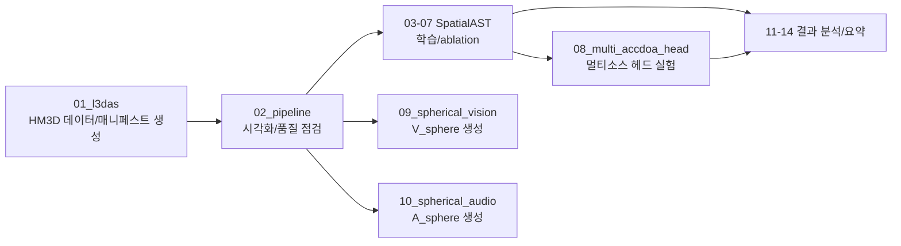

# SpatialAudio

## 로봇 실세계 멀티모달 인지 R&D의 오디오 트랙

> 본 저장소는 **“로봇을 위한 실세계 강인한 멀티모달 시공간 인지 기반의 전역적 동적 환경 인식 원천기술 개발”** 과제에서  
> **오디오 인지/학습 파이프라인**을 담당하는 연구·개발 코드베이스입니다.

---

## 프로젝트 포지셔닝

`SpatialAudio`는 다음을 목표로 합니다.

1. 실환경에서 강인한 방향/공간 음향 단서(FOA, AmbiX) 추출
2. 로봇 관점의 기하·가시성 맥락(LOS/NLOS, FOV)과 결합 가능한 학습 데이터 구축
3. `V_sphere`(vision)와 정합 가능한 `A_sphere`(audio) 표현 정의
4. SpatialAST 계열 모델 및 ACCDOA 계열 헤드 실험을 통한 성능 고도화

---

## End-to-End 흐름



---

## 리포지토리 맵

### 1) 데이터 생성·검증

| 디렉토리 | 역할 |
| --- | --- |
| `01_l3das` | HM3D 기반 단일 소스 공간음향 데이터셋 생성 |
| `02_pipeline` | 샘플 단위 진단 시각화(RGB/Depth/PointCloud/Beam/IV) |

### 2) 오디오 모델링(SpatialAST 계열)

| 디렉토리 | 역할 |
| --- | --- |
| `03_spatialast_FOA` | FOA 기본 학습 베이스라인 |
| `04_spatialast_FOA_conv` | stem 폭(채널) ablation |
| `05_spatialast_FOA_conv64x2` | stem 깊이(다층) ablation |
| `06_spatialast_FOA_frontreg` | front-cone 회귀 supervision 실험 |
| `07_spatialast_FOA_front9_and_reg` | front9/회귀/full360 staged 확장 실험 |
| `08_multi_accdoa_head` | Multi-ACCDOA source-slot head 독립 실험 |

### 3) 멀티모달 정합용 표현

| 디렉토리 | 역할 |
| --- | --- |
| `09_spherical_vision` | RGB/Depth -> `V_sphere` 변환 |
| `10_spherical_audio` | FOA wav -> `A_sphere` 변환 |

### 4) 실험 결과 분석

| 디렉토리 | 역할 |
| --- | --- |
| `11_decode_overfit_test` | decode overfit 결과 분석 |
| `12_overfit_baseline` | audio vs AV overfit 비교 |
| `13_validation` | validation 결과 요약 |
| `14_curriculum_baseline` | curriculum vs end-to-end 비교 분석 |

---

## 빠른 시작 가이드

```bash
# 1) 데이터 생성
cd 01_l3das/hm3d_l3das23_single_mic_dataset_gen

# 2) 품질 점검/시각화
cd ../../02_pipeline

# 3) 오디오 모델 학습 실험
cd ../03_spatialast_FOA

# 4) 결과 분석
cd ../11_decode_overfit_test
```

각 단계의 상세 실행 명령은 **해당 디렉토리의 `README.md`**를 참고하세요.

---

## 연구 공통 규칙

- FOA 채널은 보통 원본 `WYZX`를 내부 `WXYZ`로 정규화해 사용합니다.
- `11~14`는 결과 보관/분석 성격이 강하며, 원본 대용량 산출물은 일부 제거되어 있을 수 있습니다.
- 실험 재현 시 경로, 매니페스트, 체크포인트 유무를 먼저 확인하세요.

