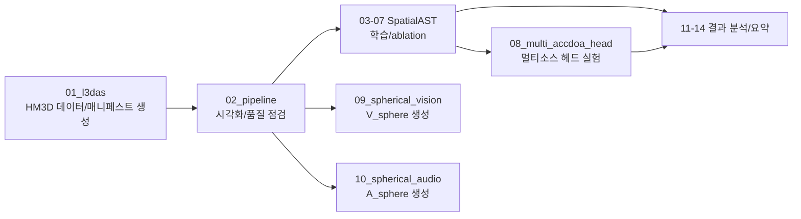

# SpatialAudio

> 본 저장소는 **“로봇을 위한 실세계 강인한 멀티모달 시공간 인지 기반의 전역적 동적 환경 인식 원천기술 개발”** 과제에서  
> **오디오 인지/학습 파이프라인**을 담당하는 연구·개발 코드베이스입니다.

---

## 프로젝트 포지셔닝

`SpatialAudio`는 다음을 목표로 합니다.

1. 실환경에서 강인한 방향/공간 음향 단서(FOA, AmbiX) 추출
2. 로봇 관점의 기하·가시성 맥락(LOS/NLOS, FOV)과 결합 가능한 학습 데이터 구축
3. `V_sphere`(vision)와 정합 가능한 `A_sphere`(audio) 표현 정의
4. SpatialAST 계열 모델 및 ACCDOA 계열 헤드 실험을 통한 성능 고도화

---

## Baseline

SpatialAudio 연구 방향을 설정하기 위한 대표 baseline 논문 3편을 아래와 같이 정리합니다.

| 모델 | 핵심 주제 |  |
| --- | --- | --- |
| **BAT (ICML 2024)** | 공간음향 인지 + LLM 추론 결합 | Spatial-AST/QA 태스크 설계 방향 |
| **Sci-Phi (ICASSP 2026)** | FOA 기반 공간 장면 기술(Description) | FOA 입력 표현과 다중 소스 파라미터 기술 |
| **Hear you are (CVPR 2026\*)** | 시각+공간음향 멀티모달 공간 추론 | `V_sphere`-`A_sphere` 정합 추론 태스크 |

### 1) BAT: Learning to Reason about Spatial Sounds with Large Language Models (ICML 2024)
- **문제 설정**: 기존 오디오 모델은 sound event detection/localization 중심이고, “공간 관계를 언어로 추론”하는 능력이 약함.
- **핵심 아이디어**:
  - 공간음향 인코더(Spatial-AST) + LLM(LLaMA-2 7B) 결합
  - Spatial sound 기반 QA 태스크로 추론 능력 학습
- **주요 기여**:
  - SpatialSoundQA 데이터셋 제안
  - SELD를 넘어 “소리 간 관계(reasoning)” 문제로 확장
- **In Ours**:
  - `03~07_spatialast_*` 실험에서 **공간 추론형 평가셋**을 별도로 구성할 필요
  - 분류/회귀 성능 외에 **언어 질의응답형 지표**를 추후 확장 가능

### 2) Sci-Phi: A Large Language Model Spatial Audio Descriptor (ICASSP 2026)

- **문제 설정**: 단일 채널 중심 오디오 LLM은 방향/거리/잔향 등 공간 파라미터 기술이 제한적임.
- **핵심 아이디어**:
  - spatial encoder + spectral encoder의 dual 구성
  - FOA 기반 다중 소스 장면을 한 번에 기술하도록 설계
- **주요 기여**:
  - 4,000시간 이상 합성 FOA 데이터 학습
  - 최대 4개 방향성 소스 + 배경음 + 실내 음향 특성(잔향 등) 동시 기술
  - permutation-invariant 평가 프로토콜과 다중 지표 설계
- **In Ours**:
  - `10_spherical_audio`의 구면 특징을 **장면 기술형 출력**으로 확장하는 방향과 정합
  - `08_multi_accdoa_head`와 결합 시, “슬롯별 기술(설명)” 태스크 설계 가능

### 3) Hear you are: Teaching LLMs Spatial Reasoning with Vision and Spatial Sound (CVPR 2026)

- **문제 설정**: 단순 audio-visual 정합(semantic/temporal correspondence)만으로는 공간 추론이 어려움.
- **핵심 아이디어**:
  - 공간음향 + 시각 정보를 LLM에 결합
  - 의미적으로 모호한 상황에서 공간 단서로 정답을 분리하는 QA 태스크 구성
- **주요 기여**:
  - Audio-Visual Spatial Reasoning 데이터셋/태스크 정의
  - 다중 후보 중 **공간 정합성**으로 정답 선택하는 추론 능력 검증
- **In Ours**:
  - `09_spherical_vision`과 `10_spherical_audio`를 결합한 **멀티모달 공간 추론 벤치마크** 설계에 직접적 근거 제공
  - 향후 scene-level reasoning에서 `sceneupdate`/scene graph 계열과의 인터페이스 확장 가능

### Baseline 비교 요약

- **BAT**: “공간음향 + LLM”의 출발점(추론 가능성 증명)
- **Sci-Phi**: “FOA 기반 장면 파라미터 기술”의 확장판(기술 능력 강화)
- **Hear you are**: “시각+공간음향 융합 추론”의 멀티모달 단계

즉, SpatialAudio는 위 3편을 따라  
**(1) 오디오 단일모달 추론 → (2) FOA 장면 기술 고도화 → (3) AV 공간추론 통합**의 로드맵으로 정렬할 수 있습니다.

참고 링크:

- BAT (ICML 2024): https://icml.cc/virtual/2024/poster/33244
- Sci-Phi (MSR 페이지): https://www.microsoft.com/en-us/research/publication/sci-phi-a-large-language-model-spatial-audio-descriptor/
- Hear you are (OpenReview): https://openreview.net/forum?id=b6s1jIHj6o

---

## End-to-End 흐름

---

## 리포지토리 맵

| 디렉토리 | 분류 | 역할 |
| --- | --- | --- |
| `01_l3das` | 데이터 생성·검증 | HM3D 기반 단일 소스 공간음향 데이터셋 생성 |
| `02_pipeline` | 데이터 생성·검증 | 샘플 단위 진단 시각화(RGB/Depth/PointCloud/Beam/IV) |
| `03_spatialast_FOA` | 오디오 모델링(SpatialAST 계열) | FOA 기본 학습 베이스라인 |
| `04_spatialast_FOA_conv` | 오디오 모델링(SpatialAST 계열) | stem 폭(채널) ablation |
| `05_spatialast_FOA_conv64x2` | 오디오 모델링(SpatialAST 계열) | stem 깊이(다층) ablation |
| `06_spatialast_FOA_frontreg` | 오디오 모델링(SpatialAST 계열) | front-cone 회귀 supervision 실험 |
| `07_spatialast_FOA_front9_and_reg` | 오디오 모델링(SpatialAST 계열) | front9/회귀/full360 staged 확장 실험 |
| `08_multi_accdoa_head` | 오디오 모델링(SpatialAST 계열) | Multi-ACCDOA source-slot head 독립 실험 |
| `09_spherical_vision` | 멀티모달 정합용 표현 | RGB/Depth -> `V_sphere` 변환 |
| `10_spherical_audio` | 멀티모달 정합용 표현 | FOA wav -> `A_sphere` 변환 |
| `11_decode_overfit_test` | 실험 결과 분석 | decode overfit 결과 분석 |
| `12_overfit_baseline` | 실험 결과 분석 | audio vs AV overfit 비교 |
| `13_validation` | 실험 결과 분석 | validation 결과 요약 |
| `14_curriculum_baseline` | 실험 결과 분석 | curriculum vs end-to-end 비교 분석 |

## Model Architecture

## 연구 공통 규칙

- FOA 채널은 보통 원본 `WYZX`를 내부 `WXYZ`로 정규화해 사용합니다.
- `11~14`는 결과 보관/분석 성격이 강하며, 원본 대용량 산출물은 일부 제거되어 있을 수 있습니다.
- 실험 재현 시 경로, 매니페스트, 체크포인트 유무를 먼저 확인하세요.
