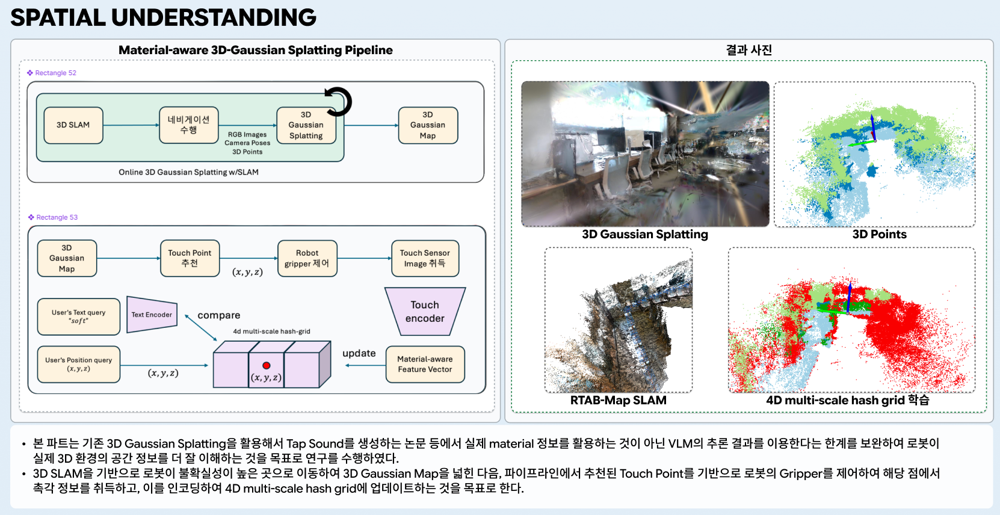
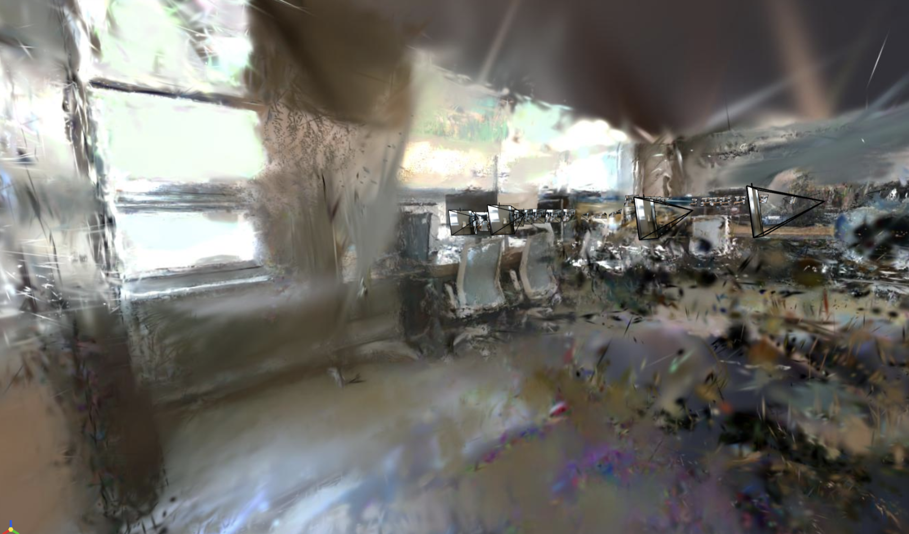
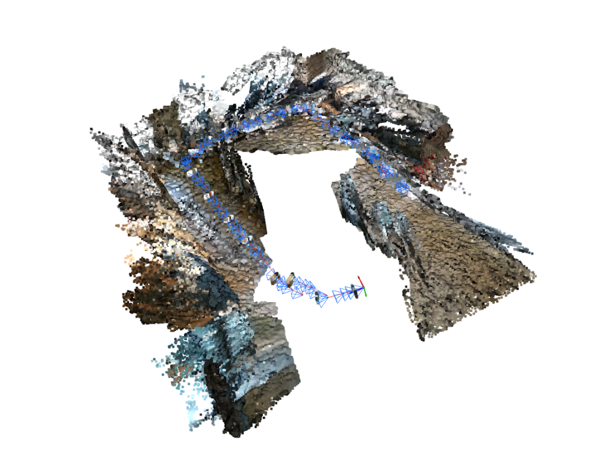
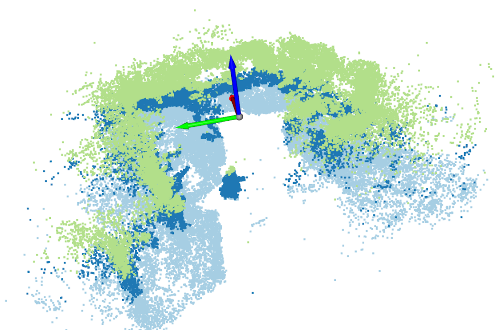
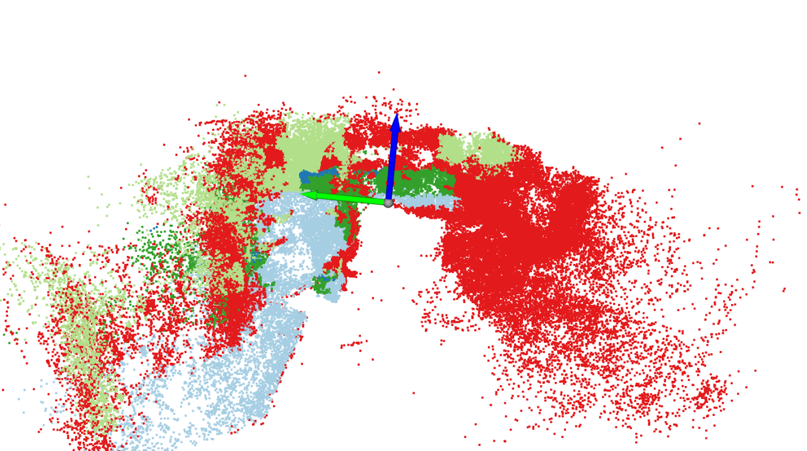

# 로봇의 High-level Spatial Information Understanding을 위한 Tactile Sensor 기반 Material-aware 3D Gaussian Splatting 파이프라인 구축

> Piper 로봇에서 RGB 이미지와 카메라/로봇 pose를 수집하고, 이를 Nerfstudio 및 자체 `online_gs_slam` 코드로 학습해 Continual Gaussian Splatting 기반 3D 맵핑하는 연구입니다.
> 그 다음, 로봇의 High-level Spatial Information Understanding을 위해 Tactile Sensor를 이용해서 로봇이 직접 contact를 수행하고, 이 Sensor Information을 기반으로 Tactile Sensor 기반 Material-aware 3D Gaussian Splatting을 수행하는 것을 목표로 합니다.
<p align="center">
  
</p>
<p align="center"><b>Overview</b></p>


## 1. 소개

본 프로젝트는 로봇의 High-level Spatial Information Understanding을 위해 Tactile Sensor를 이용해서 로봇이 직접 contact를 수행하고, 이 Sensor Information을 기반으로 Tactile Sensor 기반 Material-aware 3D Gaussian Splatting을 수행하는 것을 목표로 합니다. 
로봇에서 직접 모든 연산을 수행하기에는 GPU 자원이 부족하므로, 로봇은 ROS topic을 통해 이미지와 pose를 발행하고, 노트북에서 데이터 수집, 변환, 학습, 시각화를 수행하는 구조로 설계했습니다.

주요 목표는 다음과 같습니다.

- RGB 또는 RGB-D frame의 online ingestion
- 카메라 pose tracking
- Gaussian map update 및 신규 Gaussian insertion
- local optimization
- uncertainty-aware exploration
- tactile / material-aware Gaussian representation 확장

> [!WARNING]
> 이 저장소는 production SLAM 시스템이 아니라 연구용 프로토타입입니다. Nerfstudio 기반 경로는 시각화와 offline/staged 실험에 유용하며, 실제 continual Gaussian SLAM 구조는 `online_gs_slam` 패키지에서 개발하는 것을 목표로 합니다.

## 2. 사용법 및 폴더 소개

### 현재 지원하는 workflow

현재 저장소는 크게 세 가지 흐름을 지원합니다.

1. ROS에서 RGB 이미지와 robot pose를 약 3 Hz로 수집합니다.
2. 수집한 dataset을 Nerfstudio 형식으로 변환하고 `splatfacto`를 학습합니다.
3. 자체 `online_gs_slam` 프로토타입을 실행해 frame-by-frame Gaussian registration 구조를 실험합니다.

실험에 사용한 기본 환경은 다음과 같습니다.

- Robot IP: `192.168.0.2`
- Laptop wired IP: `192.168.0.100`
- Camera topic: `/camera/color/image_raw`
- Throttled camera topic: `/camera/color/image_raw_3hz`
- Pose source: `/robot/odom`
- Laptop GPU: NVIDIA RTX 3060 Laptop GPU
- Conda env: `~/miniconda3/envs/ns310`

### 폴더 구조

```text
src/uni_navigation/
  launch/
    collect_rgb_pose.launch
    uni_navigation_demo.launch
  scripts/
    collect_rgb_pose.py
    rgb_pose_to_nerfstudio.py

online_gs_slam/
  data/
  tracking/
  mapping/
  rendering/
  material/
  utils/

scripts/
  start_laptop_rgb_pose_collection.sh
  start_robot_image_throttle.sh
  export_nerfstudio_dataset.sh
  train_nerfstudio_splatfacto.sh
  train_nerfstudio_splatfacto_ns310.sh
  train_nerfstudio_continual_stages.sh
  check_gsplat_backend.py
  view_gsplat_checkpoint.py

configs/
  online_gs_slam.yaml

docs/
  server_time_sync.md
  mapping_and_navigation.md
  piper_rgb_pose_collection.md
  online_gs_slam_pipeline.md
```

### Robot network 및 time sync

로봇에는 직접 학습을 수행할 GPU가 없으므로, 로봇은 ROS 데이터를 발행하고 노트북이 dataset logging과 Gaussian training을 담당합니다.

관련 문서는 다음 파일에 정리되어 있습니다.

- `docs/server_time_sync.md`
- `docs/mapping_and_navigation.md`

본 실험에서는 로봇의 IP를 `192.168.0.2`로 고정하고, 노트북의 유선 인터페이스 IP를 `192.168.0.100`으로 설정했습니다. 로봇에서 `chrony.service`가 masked 상태였기 때문에 time sync는 `ntpdate`를 사용해 맞췄습니다.

### RGB + Pose 데이터 수집

로봇에서 camera image stream을 3 Hz로 throttle합니다.

```bash
cd ~/catkin_ws
./scripts/start_robot_image_throttle.sh
```

노트북에서는 RGB image와 pose를 함께 수집합니다.

```bash
cd ~/catkin_ws
DATA_DIR=/home/harudev/rgb_pose_dataset_01 \
./scripts/start_laptop_rgb_pose_collection.sh
```

데이터 수집 결과는 아래 구조로 저장됩니다.

```text
rgb_pose_dataset_01/
  rgb/
    000000.png
    000001.png
    ...
  poses.csv
  poses_tum.txt
  camera_info.json
  metadata.json
```

기본 수집 주기는 약 3 Hz입니다.

### Nerfstudio dataset export

수집한 ROS dataset을 Nerfstudio 형식으로 변환합니다.

```bash
cd ~/catkin_ws
DATA_DIR=/home/harudev/rgb_pose_dataset_01 \
OUTPUT=/home/harudev/catkin_ws/outputs/nerfstudio_data/piper \
KEEP_EVERY=3 \
START_INDEX=1000 \
./scripts/export_nerfstudio_dataset.sh
```

주요 sampling option은 다음과 같습니다.

- `KEEP_EVERY=3`: 원본 frame 3개마다 1개씩 export합니다.
- `START_INDEX=1000`: 처음 1000개 frame을 제외하고 변환합니다.
- `MAX_FRAMES=512`: export할 최대 frame 수를 제한합니다.
- `MAX_FRAMES`를 설정하지 않으면 `START_INDEX` 이후의 sampled frame을 모두 사용합니다.

> [!NOTE]
> `KEEP_EVERY=3`은 한 번에 3장의 이미지를 추가한다는 의미가 아니라, frame stride를 3으로 둔다는 의미입니다.

### Nerfstudio / gsplat 환경

Nerfstudio 학습 환경을 활성화합니다.

```bash
source ~/miniconda3/etc/profile.d/conda.sh
conda activate ns310
```

CUDA, PyTorch, gsplat 설치 상태를 확인합니다.

```bash
python -c "import torch, gsplat; print(torch.__version__, torch.cuda.is_available(), gsplat.__version__)"
```

실험에 사용한 환경은 다음과 같습니다.

```text
torch 2.4.1+cu121
cuda available True
gsplat 1.4.0+pt24cu121
nerfstudio 1.1.5
```

로컬 CUDA compile은 시간이 오래 걸리고 메모리를 많이 사용했기 때문에, `gsplat`은 JIT compile보다 prebuilt wheel을 사용하는 방식이 안정적이었습니다.

### Offline Nerfstudio Splatfacto 학습

Nerfstudio의 `splatfacto`를 baseline으로 학습합니다.

```bash
cd ~/catkin_ws
unset MAX_FRAMES
DATA_DIR=/home/harudev/rgb_pose_dataset_01 \
START_INDEX=1000 \
KEEP_EVERY=3 \
CAMERA_RES_SCALE_FACTOR=0.35 \
MAX_NUM_ITERATIONS=10000 \
MAKE_SHARE_URL=True \
VIEWER_MAX_NUM_DISPLAY_IMAGES=512 \
./scripts/train_nerfstudio_splatfacto_ns310.sh
```

주요 option은 다음과 같습니다.

- `CAMERA_RES_SCALE_FACTOR=0.35`: 16 GB RAM 환경에서 image resolution을 낮춰 메모리 사용량을 줄입니다.
- `VIEWER_MAX_NUM_DISPLAY_IMAGES=512`: viewer에 표시할 training camera/image 수를 제한합니다.
- `MAKE_SHARE_URL=True`: 임시 Viser share URL을 생성합니다.
- `MAX_NUM_ITERATIONS=10000`: 학습 iteration 수를 설정합니다.

> [!IMPORTANT]
> Nerfstudio는 학습 시작 시점에 dataset을 읽습니다. 학습 도중 folder에 새 이미지가 추가되어도 `ns-train splatfacto`가 이를 자동으로 새 training frame으로 받아들이지는 않습니다.

### Staged Continual Nerfstudio 실험

Nerfstudio 자체는 true online continual ingestion을 지원하지 않기 때문에, 누적 stage 방식으로 continual-learning과 유사한 실험을 구성했습니다.

1. 일부 frame subset을 구성합니다.
2. 한 stage를 학습합니다.
3. checkpoint를 저장합니다.
4. frame을 추가합니다.
5. 이전 checkpoint에서 resume합니다.

안정적으로 사용한 staged command는 다음과 같습니다.

```bash
cd ~/catkin_ws
SOURCE_DATA_DIR=/home/harudev/rgb_pose_dataset_01 \
EXPERIMENT_NAME=piper_continual_stride20_stable \
SAMPLE_STRIDE=20 \
INITIAL_SAMPLED_FRAMES=40 \
ADD_SAMPLED_FRAMES=40 \
NUM_STAGES=9 \
ITERATIONS_PER_STAGE=1000 \
VIS=tensorboard \
MAKE_SHARE_URL=False \
CAMERA_RES_SCALE_FACTOR=0.35 \
REFINE_EVERY=1000000 \
RESET_ALPHA_EVERY=1000000 \
STOP_SPLIT_AT=0 \
STOP_SCREEN_SIZE_AT=0 \
CULL_ALPHA_THRESH=0.0 \
CULL_SCALE_THRESH=1000000.0 \
DENSIFY_GRAD_THRESH=1000000.0 \
./scripts/train_nerfstudio_continual_stages.sh
```

> [!WARNING]
> 이 방식은 Nerfstudio checkpoint resume을 이용한 staged workaround이며, true online continual Gaussian Splatting은 아닙니다. Densify/prune을 활성화하면 품질이 좋아질 수 있지만, stage resume 과정에서 `gsplat/strategy/default.py::_prune_gs`의 CUDA device-side assert 문제가 발생했습니다. 위 command는 crash를 피하기 위해 대부분의 densify/prune 동작을 비활성화했으며, 이로 인해 결과가 다소 blurry해질 수 있습니다.

### Custom Online GS SLAM 프로토타입

`online_gs_slam` 패키지는 true continual Gaussian Splatting SLAM을 구현하기 위한 연구용 backbone입니다.

현재 포함된 주요 구성 요소는 다음과 같습니다.

- `Frame`, `CameraIntrinsics` dataclass
- live RGB-pose dataset reader
- `GaussianMap` 자료구조
- Gaussian means, scales, rotations, opacity, color, observation count, uncertainty, material feature 관리
- Gaussian insertion module
- local mapper
- keyframe manager
- uncertainty utility
- tactile/material extension hook
- `gsplat` renderer abstraction

프로토타입 실행 명령은 다음과 같습니다.

```bash
cd ~/catkin_ws
DATA_DIR=/home/harudev/rgb_pose_dataset_01 \
OUTPUT_DIR=/home/harudev/catkin_ws/outputs/scene01 \
./scripts/start_online_gs_registration.sh
```

실행 결과는 아래 구조로 저장됩니다.

```text
outputs/scene01/
  checkpoints/
    gaussians_latest.pt
  gaussians_latest.ply
  trajectory.json
  summary.json
  debug/
    compare_latest.png
```

> [!NOTE]
> `gaussians_latest.ply`는 Gaussian center와 color를 point-cloud 형태로 export한 파일에 가깝습니다. Nerfstudio viewer에서 사용하는 interactive Gaussian export와 동일한 형식은 아닙니다.

### Custom checkpoint 시각화

간단한 OpenCV viewer를 사용해 custom checkpoint를 확인할 수 있습니다.

```bash
cd ~/catkin_ws
python3 scripts/view_gsplat_checkpoint.py \
  --output_dir outputs/scene01 \
  --data_dir /home/harudev/rgb_pose_dataset_01 \
  --checkpoint outputs/scene01/checkpoints/gaussians_latest.pt
```

Viewer 조작키는 다음과 같습니다.

- `W/S`: forward/backward 이동
- `A/D`: left/right 이동
- `Q/E`: down/up 이동
- arrow keys: yaw/pitch 조정
- `R`: camera reset
- `P`: snapshot 저장
- `ESC`: 종료

## 3. 연구 내용

### 3.1 RGB-Pose dataset 구성

본 프로젝트에서는 Piper 로봇의 camera image와 odometry 기반 pose를 같은 시간축에서 수집하여 Gaussian Splatting 학습에 사용할 수 있는 dataset을 구성했습니다. 로봇에서는 `/camera/color/image_raw`와 `/robot/odom`을 발행하고, 노트북에서는 image stream을 `/camera/color/image_raw_3hz`로 throttle한 뒤 image와 pose를 함께 저장합니다.

수집된 dataset은 `rgb/` image folder, `poses.csv`, `poses_tum.txt`, `camera_info.json`, `metadata.json`으로 구성됩니다. 이 구조는 원본 ROS dataset으로 사용되며, 이후 Nerfstudio 학습을 위해 `transforms.json` 기반 dataset으로 변환됩니다.

### 3.2 Nerfstudio 기반 baseline reconstruction

첫 번째 baseline은 Nerfstudio의 `splatfacto`를 사용하는 offline 3D Gaussian Splatting reconstruction입니다. 이 단계에서는 수집된 모든 frame 또는 sampling된 frame subset을 학습 시작 시 한 번에 로드하고, 고정 dataset에 대해 Gaussian scene을 최적화합니다.

이 방식은 구현이 안정적이고 viewer를 통해 결과를 쉽게 확인할 수 있다는 장점이 있습니다. 하지만 학습 중 새로 수집되는 frame을 자동으로 받아들이지 못하므로, 로봇이 이동하면서 map을 계속 갱신하는 online SLAM 구조와는 차이가 있습니다.

### 3.3 Continual learning 형태의 staged 실험

Nerfstudio에서 직접 online frame ingestion이 어렵기 때문에, frame subset을 단계적으로 늘려가며 checkpoint를 resume하는 staged continual experiment를 구성했습니다. 각 stage에서는 이전 stage에서 학습한 checkpoint를 불러오고, 더 많은 frame을 포함한 dataset으로 추가 학습을 수행합니다.

이 방식은 continual reconstruction의 가능성을 실험하는 데에는 유용하지만, stage 사이에서 densify/prune이 불안정하게 동작할 수 있고, 새 관측에 맞춰 Gaussian을 적극적으로 삽입하는 true online 방식은 아닙니다.

### 3.4 Custom online Gaussian SLAM 구조

장기적인 목표를 위해 별도의 `online_gs_slam` 패키지를 구성했습니다. 이 패키지는 frame을 순차적으로 읽고, 현재 Gaussian map과 비교하면서 registration, insertion, local mapping, keyframe management를 수행하는 구조를 지향합니다.

현재 구현은 초기 prototype 단계이며, RGB-only mode에서는 depth 정보가 부족하기 때문에 Gaussian insertion에 rough placeholder depth assumption을 사용합니다. 향후 RGB-D backprojection, monocular depth prior, photometric pose tracking, local keyframe window optimization을 추가하면 실제 continual Gaussian SLAM에 가까운 구조로 확장할 수 있습니다.

### 3.5 Mapping and navigation

2D navigation을 위해서는 기존 ROS navigation pipeline을 함께 사용할 수 있습니다.

1. `gmapping`과 같은 SLAM package를 실행합니다.
2. 로봇을 주행시켜 occupancy map을 생성합니다.
3. `/map`이 publish되는 동안 map을 저장합니다.
4. `gmapping`을 종료합니다.
5. 저장된 map으로 localization/navigation을 실행합니다.

상세 명령과 `map_server` 관련 주의사항은 `docs/mapping_and_navigation.md`에 정리되어 있습니다.

## 4. 현재 결과 및 한계

현재 구현을 통해 RGB image와 pose를 수집하고, Nerfstudio 형식으로 변환한 뒤 `splatfacto` baseline을 학습하는 pipeline은 구성했습니다. 또한 staged continual training script와 자체 `online_gs_slam` prototype을 통해 true continual Gaussian Splatting SLAM으로 확장하기 위한 기본 구조를 마련했습니다.

### 4.1 결과 시각화

아래 이미지는 동일한 RGB-pose 수집 데이터를 바탕으로 생성한 주요 중간 결과와 학습 결과를 보여줍니다. Gaussian Splatting 결과는 Nerfstudio `splatfacto` 기반 reconstruction의 시각화이며, RTAB-Map 결과는 로봇 주행 중 생성된 point cloud map과 camera trajectory를 함께 나타냅니다. Initial 3D points는 Gaussian map을 구성하기 전 초기 point distribution을 확인하기 위한 결과이고, 4D multi-scale hash grid 학습 시각화는 시간 또는 scale 정보를 포함한 representation 학습 과정에서 point feature가 확장되는 양상을 보여줍니다.

<p align="center">
  
</p>
<p align="center"><b>Gaussian Splatting 결과</b></p>

<p align="center">
  
</p>
<p align="center"><b>RTAB-Map 기반 point cloud map 및 camera trajectory</b></p>

<p align="center">
  
</p>
<p align="center"><b>Initial 3D points</b></p>

<p align="center">
  
</p>
<p align="center"><b>4D multi-scale hash grid 학습 시각화</b></p>

이 결과를 통해 RGB-pose 수집 pipeline이 실제 3D reconstruction 입력으로 사용될 수 있음을 확인했습니다. 또한 RTAB-Map 기반 point cloud와 Gaussian Splatting 결과를 함께 비교하면서, classical SLAM map과 neural rendering 기반 map이 서로 다른 방식으로 공간 정보를 표현한다는 점을 확인할 수 있습니다.

### 4.2 한계

다만 현재 단계에는 다음과 같은 한계가 있습니다.

- Nerfstudio `splatfacto`는 하나의 학습 process 안에서 live image ingestion을 지원하지 않습니다.
- Staged Nerfstudio resume은 densify/prune이 활성화된 상태에서 crash가 발생할 수 있습니다.
- `online_gs_slam` 구현은 아직 초기 단계이며 residual-based insertion, RGB-D backprojection, local bundle-style optimization이 더 필요합니다.
- RGB-only Gaussian insertion은 현재 rough placeholder depth assumption에 의존합니다.
- Camera pose는 대부분 odometry를 신뢰하며, full photometric pose tracking은 향후 구현 대상입니다.
- 16 GB RAM 노트북에서는 full-resolution caching 또는 viewer image 수가 많을 경우 system freeze가 발생할 수 있습니다.

## 5. 향후 연구 방향

향후 목표는 staged Nerfstudio training을 넘어, `online_gs_slam` 내부에서 true continual Gaussian Splatting을 구현하는 것입니다.

구체적인 후속 연구 방향은 다음과 같습니다.

- ROS 또는 live dataset folder에서 frame을 하나씩 받아들이는 online ingestion
- local keyframe window만 최적화하는 구조
- unexplained / high-residual region에서 신규 Gaussian insertion
- Gaussian별 uncertainty estimation
- high-uncertainty region 기반 active robot exploration
- tactile feedback을 주변 Gaussian의 material embedding으로 통합
- RGB-D depth backprojection 기반 insertion
- monocular depth prior를 이용한 RGB-only mode 개선
- SE(3) photometric tracking loop
- local keyframe window optimization
- tactile encoder
- material-aware Gaussian embedding
- semantic/material Gaussian field
- 2D mask supervision을 Gaussian-level feature로 projection하는 LEGS-style language supervision

## 6. Related Work

본 프로젝트와 가까운 참고 연구로는 Language-Embedded Gaussian Splats (LEGS)가 있습니다.

- Paper: "Language-Embedded Gaussian Splats (LEGS): Incrementally Building Room-Scale Representations with a Mobile Robot"
- Code: https://github.com/uynitsuj/LEGS
- Project: https://berkeleyautomation.github.io/LEGS/

LEGS는 mobile robot을 이용한 incremental room-scale Gaussian map construction, Gaussian representation에 language/semantic embedding을 결합하는 방식, Nerfstudio-style custom method integration 측면에서 본 프로젝트의 방향과 유사합니다.

본 프로젝트는 현재 RTAB-Map/Nerfstudio를 practical data export와 visualization에 활용하고, `online_gs_slam`을 continual RGB-D Gaussian insertion, uncertainty, tactile/material update를 위한 실험용 backbone으로 유지하는 방향으로 구성했습니다.
