  

<div align="center">
  <br><br>
  <h1>로봇을 위한 실세계 강인한 멀티모달 시공간 인지 기반의 전역적 동적 환경 인식 원천기술 개발</h1>
  <i>"시각, 청각, 촉각 및 계층적 기억을 융합한 로봇 지능 원천기술"</i>
</div>
<br>

> 본 프로젝트는 시각, 청각, 촉각 및 계층적 기억(Memory)을 융합하여 로봇이 복잡하고 동적인 실세계 환경을 전역적으로 이해하고, 이를 바탕으로 지능적인 행동을 수행하도록 돕는 인지 중심의 원천기술을 다룹니다.  
> **💡 본 저장소는 단일 애플리케이션이 아니라, 로봇이 실제 환경에서 사람과 상호작용하고 공간을 이해하기 위한 여러 연구 모음(perception, mapping, planning 등)을 포함하는 통합 연구 저장소입니다.**

---

## 📌 Project Overview Q&A

<details>
  <summary><b>🙋‍♂️ 1) 이 기술은 누가 사용하는 건가요?</b> (클릭해서 보기)</summary>
  <div markdown="1">
    <br>
    자율주행 서비스 로봇 및 모바일 매니퓰레이터를 개발하는 로보틱스 엔지니어와 멀티모달 AI 연구자들이 사용합니다.
  </div>
</details>

<details>
  <summary><b>⏱️ 2) 이 기술은 언제 사용하는 건가요?</b> (클릭해서 보기)</summary>
  <div markdown="1">
    <br>
    로봇 자체 소음이 크거나, 물체가 실시간으로 이동하고, 가려진 공간이 존재하는 실제 가정 및 산업 현장에서 로봇의 안정적인 임무 수행이 필요할 때 사용합니다.
  </div>
</details>

<details>
  <summary><b>💡 3) 이 기술을 사용하면 무엇이 해결(개선)되나요?</b> (클릭해서 보기)</summary>
  <div markdown="1">
    <br>
    <ul>
      <li><b>소음 극복</b>: 사족보행 로봇의 구동 소음 속에서도 깨끗한 음성 명령을 추출합니다.</li>
      <li><b>입체적 인지</b>: 단순히 보는 것을 넘어 소리의 위치와 공간의 기하학적 구조를 결합해 이해합니다.</li>
      <li><b>기억의 고도화</b>: 한 번 본 환경을 계층적으로 저장하고, 변화하는 물체 상태를 실시간으로 씬그래프에 반영합니다.</li>
      <li><b>안전한 행동</b>: '어디에 물건을 놓아야 가장 안전한지'와 같은 고차원적인 판단을 실시간 빈공간 분석을 통해 수행합니다.</li>
    </ul>
  </div>
</details>

<details>
  <summary><b>🚀 4) 이 기술이 되면 사람들이 사용할까요?</b> (클릭해서 보기)</summary>
  <div markdown="1">
    <br>
    통제되지 않은 실환경(In-the-wild)에서 로봇의 자율성을 비약적으로 높여주기 때문에, 차세대 가전 및 물류 로봇 시장에서 핵심 솔루션으로 활용될 것입니다.
  </div>
</details>

---

## 👥 Team Profiles

| 이름 | 역할 | 담당 컴포넌트 (폴더명) | 주요 기술 스택 |
| :---: | :---: | :--- | :--- |
| **류재우** | 팀장 | **Denoising**<br>(`LRDSE`) |   |
| **이성빈** | 팀원 | **Task Execution**<br>(`sceneupdate`) |   |
| **유동현** | 팀원 | **SpatialAudio**<br>(`SpatialAudio`) |   |
| **유채희** | 팀원 | **Memory**<br>(`hierarchy_...`) |   |
| **장근서** | 팀원 | **Tactile**<br>(`catkin_ws`) |   |

---

# 🧩 Components Detail

<div style="background-color: #f8f9fa; padding: 15px; border-radius: 10px; border-left: 5px solid #ff6f00; margin-bottom: 15px;">
  <b>🎧 1. SpatialAudio (유동현)</b><br>
  로봇 관점의 기하학적 맥락과 앰비소닉(Ambisonics) 오디오를 결합한 공간 음향 인지 시스템입니다.
  <ul>
    <li><b>주요 기능</b>: HM3D 기반 LOS/NLOS·FOV/OOF 공간음향 데이터 생성, FOA 방향 단서 추출, SpatialAST-FOA 모델 학습 및 진단 시각화</li>
    <li><b>차별점</b>: 시각 정보(<code>V_sphere</code>)와 오디오 정보(<code>A_sphere</code>)를 같은 구면 좌표계로 정합하여 보이지 않는 영역의 음원까지 통합 인지</li>
    <li><b>주요 참고 논문</b>:
      <ul>
        <li>BAT: Learning to Reason about Spatial Sounds with Large Language Models</li>
        <li>Sci-Phi: A Large Language Model Spatial Audio Descriptor</li>
        <li>Hear you are: Teaching LLMs Spatial Reasoning with Vision and Spatial Sound</li>
      </ul>
    </li>
  </ul>
</div>

<div style="background-color: #f8f9fa; padding: 15px; border-radius: 10px; border-left: 5px solid #4b32c3; margin-bottom: 15px;">
  <b>🔇 2. Denoising (류재우)</b><br>
  로봇 구동 시 발생하는 강력한 하드웨어 노이즈를 제거하는 로봇 특화 음성 향상 기술입니다.
  <ul>
    <li><b>주요 기능</b>: SGMSE 및 RDDM 기반의 Diffusion 모델을 사용하여 깨끗한 음성 복원</li>
    <li><b>차별점</b>: 발이 지면을 밀어내는 힘(Foot force) 데이터를 보조 조건으로 입력받아 정밀한 소음 제거</li>
    <li><b>주요 참고 논문</b>:
    <ul>
        <li>Denoising Diffusion Probabilistic Models</li>
        <li>Speech Enhancement and Dereverberation with Diffusion-Based Generative Models</li>
        <li>Noise-aware Speech Enhancement using Diffusion Probabilistic Model</li>
        <li>Ego-Noise Reduction Using a Motor Data-Guided Multichannel Dictionary</li>
        <li>Morphology-Informed Heterogeneous Graph Neural Network for Legged Robot Contact Perception</li>
        <li>SonicSim: A Customizable Simulation Platform for Speech Processing in Moving Sound Source Scenarios</li>
      </ul>
    </li>
  </ul>
</div>

<div style="background-color: #f8f9fa; padding: 15px; border-radius: 10px; border-left: 5px solid #ffb020; margin-bottom: 15px;">
  <b>🧠 3. Memory (유채희)</b><br>
  환경을 '건물-층-방-객체'로 구조화하여 관리하는 계층형 씬그래프 메모리 시스템입니다.
  <ul>
    <li><b>주요 기능</b>: ConceptGraph를 활용한 맵 생성 및 객체 변화를 실시간으로 씬그래프에 반영</li>
    <li><b>차별점</b>: 장단기 메모리 구조를 통해 과거 경험 바탕으로 현재 작업(Rearrangement 등) 계획</li>
    <li><b>주요 참고 논문</b>:
      <ul>
        <li>ConceptGraphs: Open-Vocabulary 3D Scene Graphs for Perception and Planning</li>
        <li>KARMA: Augmenting Embodied AI Agents with Long-and-short Term Memory Systems</li>
        <li>Hierarchical Open-Vocabulary 3D Scene Graphs for Language-Grounded Robot Navigation</li>
        <li>Dynamic Open-Vocabulary 3D Scene Graphs for Long-term Language-Guided Mobile Manipulation</li>
      </ul>
    </li>
  </ul>
</div>

<div style="background-color: #f8f9fa; padding: 15px; border-radius: 10px; border-left: 5px solid #008080; margin-bottom: 15px;">
  <b>🤲 4. Tactile (장근서)</b><br>
  시각 정보와 촉각/재질 정보를 융합하기 위한 3D Gaussian Splatting 기반 SLAM 시스템입니다.
  <ul>
    <li><b>주요 기능</b>: RGB-Pose 데이터를 바탕으로 3D 가우시안 맵 생성 및 업데이트</li>
    <li><b>차별점</b>: 가우시안 맵에 재질(Material) 정보를 임베딩하여 시각적 형태 및 질감까지 이해</li>
    <li><b>주요 참고 논문</b>:
      <ul>
        <li>3D Gaussian Splatting for Real-Time Radiance Field Rendering</li>
        <li>CL-Splats: Continual Learning of Gaussian Splatting with Loal Optimization</li>
        <li>LEGS: Incrementally Building Room-Scale Language-Embedded Gaussian Splats with a Mobile Robot</li>
        <li>GaussianUpdate: Continual 3D Gaussian Splatting Update for Changing Environments</li>
        <li>GS3LAM: Gaussian Semantic Splatting SLAM</li>
        <li>Gaussian Grouping: Segment and Edit Anything in 3D Scenes</li>
      </ul>
    </li>
  </ul>
</div>

<div style="background-color: #f8f9fa; padding: 15px; border-radius: 10px; border-left: 5px solid #76b900; margin-bottom: 15px;">
  <b>🤖 5. Task Execution (이성빈)</b><br>
  LLM과 실시간 씬그래프를 결합하여 복잡한 명령을 수행하는 로봇 작업 지능 모듈입니다.
  <ul>
    <li><b>주요 기능</b>: 동적 환경 그리고 빈공간에 대한 정보를 담은 씬그래프 구축 및 이를 활용한 task planning</li>
    <li><b>차별점</b>: <b>빈공간 스코어링</b>으로 낙하/충돌 위험을 고려한 최적의 배치 지점(Sweet Spot) 실시간 계산 및 VLM이 빈공간 추론을 더 잘하기 위한 파인튜닝용 데이터 생성 파이프라인 구축</li>
    <li><b>주요 참고 논문</b>:
      <ul>
        <li>ConceptGraphs: Open-Vocabulary 3D Scene Graphs for Perception and Planning</li>
        <li>REACT: Real-time Efficient Attribute Clustering and Transfer for Updatable 3D Scene Graph</li>
        <li>SayPlan: Grounding Large Language Models using 3D Scene Graphs for Scalable Robot Task Planning</li>
        <li>RoboSpatial: Teaching Spatial Understanding to 2D and 3D Vision-Language Models for Robotics</li>
      </ul>
    </li>
  </ul>
</div>

---

## 🎬 DEMO (팀원별 결과 및 시각 자료)

### 🎧 1. SpatialAudio

앰비소닉(FOA/AmbiX) 오디오와 로봇 관점 RGB/Depth 기하 정보를 함께 사용해, 음원이 보이는 영역(FOV)과 화면 밖 영역(OOF), 직접 경로(LOS)와 차폐 경로(NLOS)에서 어떻게 관측되는지 진단하는 공간 음향 인지 파이프라인입니다.

#### SpatialAST-FOA 모델 구조

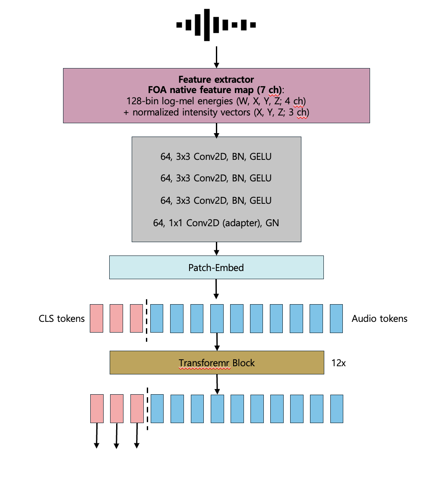

#### HM3D LOS/NLOS 파이프라인 대표 결과

`SpatialAudio/02_pipeline/example_outputs`에서 대표 4개 케이스를 골라 정리했습니다. `14_overview.png`는 RGB, Depth, PointCloud, beam map, intensity vector를 한 번에 보여주는 샘플 진단 화면이고, `15_beam_filtered_overlays.gif`는 시간 구간별 beamforming 결과가 시야 위에 어떻게 누적되는지 보여주는 overlay GIF입니다.

| Case | Overview | Windowed Beam Overlay |
| --- | --- | --- |
| **LOS + FOV**<br>전방에 보이는 직접 경로 음원<br>`00006-HkseAnWCgqk` | 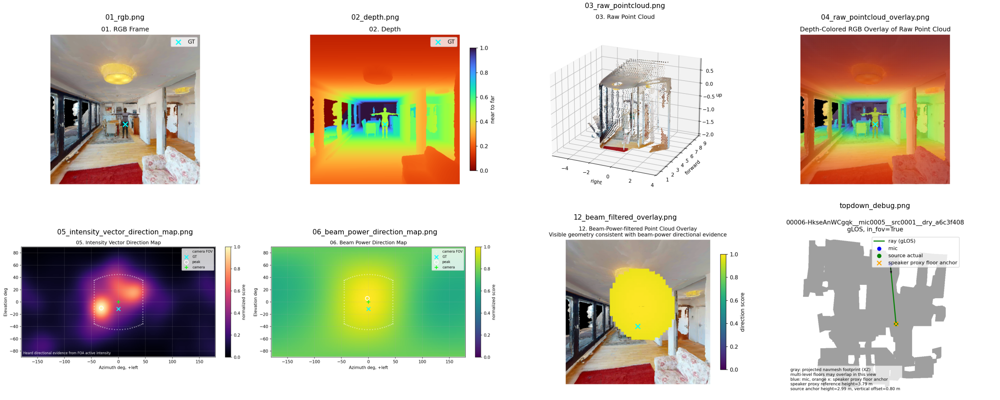 | 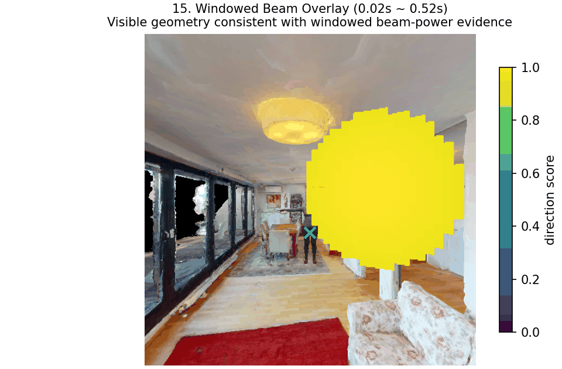 |
| **LOS + OOF**<br>직접 경로지만 화면 밖에 있는 음원<br>`00016-qk9eeNeR4vw` | 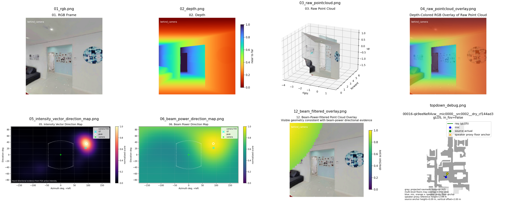 | 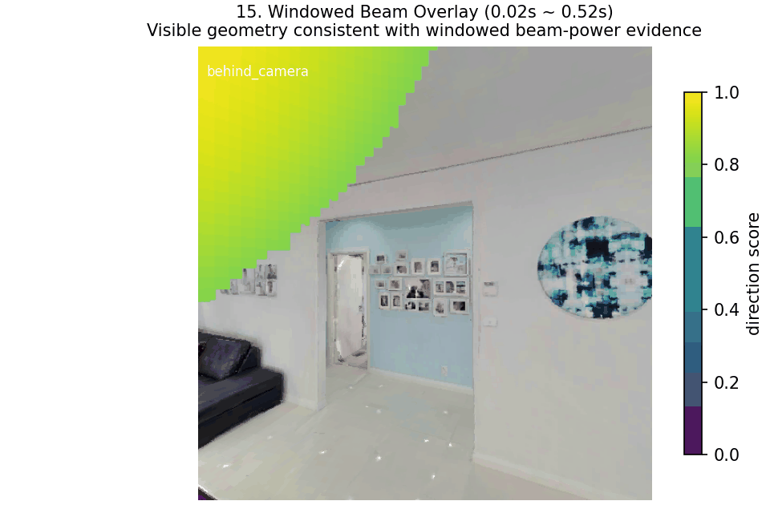 |
| **NLOS + FOV**<br>시야 안에 있지만 차폐·반사 영향을 받는 음원<br>`00031-Wo6kuutE9i7` | 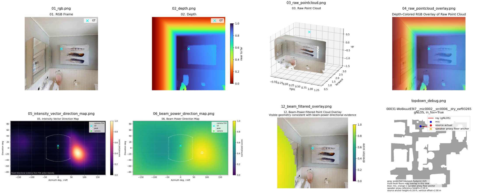 | 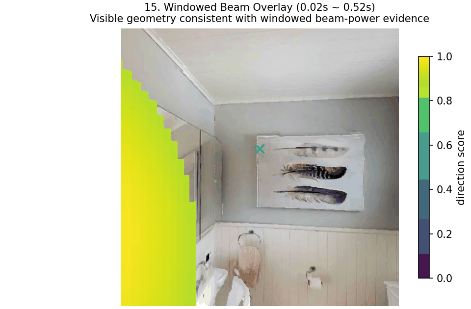 |
| **NLOS + OOF**<br>화면 밖에서 차폐된 상태로 들어오는 음원<br>`00081-5biL7VEkByM` | 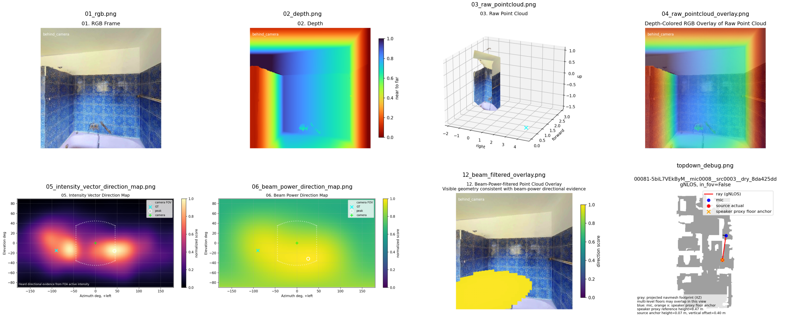 | 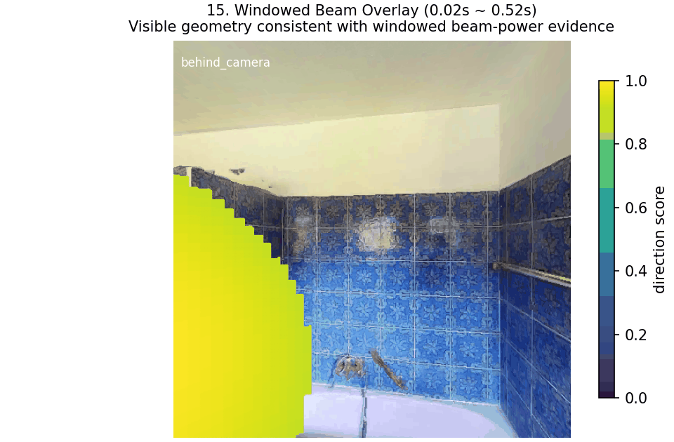 |

#### 결과 그래프

SpatialAST-FOA 실험에서는 활동 유형별 공간음향 추정 성능을 비교했고, Audio Encoder MAE 실험에서는 오디오 인코더 구성에 따른 평균 절대 오차(MAE)를 정리했습니다.

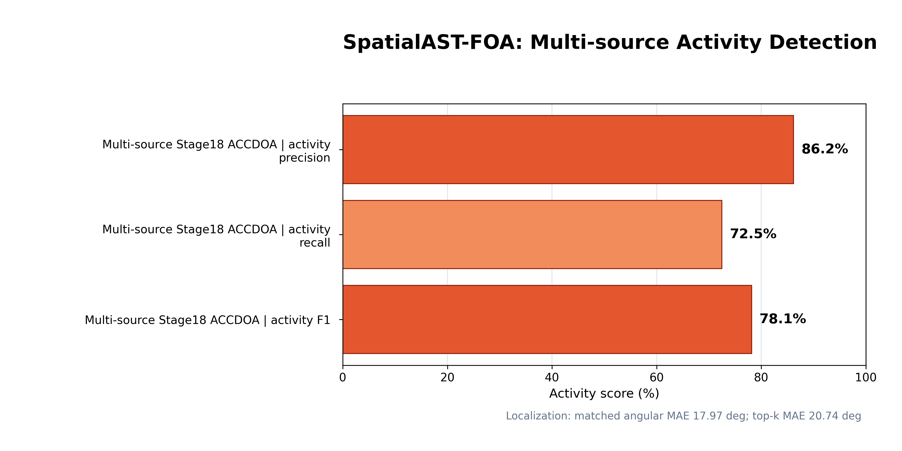

<br>

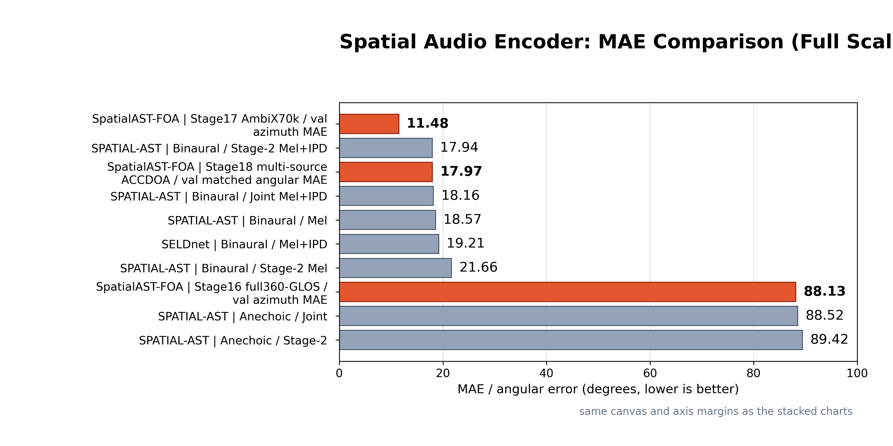

<br>

### 🔇 2. Denoising
> 
>
> 사족보행 로봇의 구동 소음이 섞인 음성에서 사람의 음성 명령을 복원하는 Speech Enhancement 결과입니다.  
> Go2에서 수집한 robot noise와 foot force 데이터를 활용하고, SGMSE 기반 모델로 noisy speech를 clean speech에 가깝게 복원했습니다.
>
> #### STFT 기반 전/후 비교
> 아래 spectrogram은 같은 utterance에 대해 clean reference, noisy input, enhanced output을 비교한 결과입니다. Noisy input에서 넓게 퍼져 있던 로봇 구동 소음 성분이 enhanced output에서 줄어들고, clean reference에 가까워지는 양상을 확인할 수 있습니다.
>
> <p align="center">
>   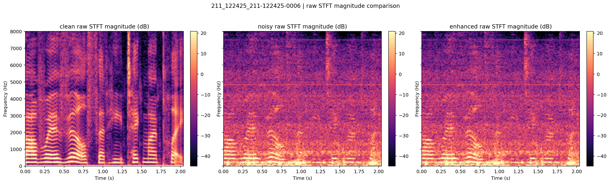
> </p>
>
> #### Audio Samples
> 약 17초 길이의 같은 utterance에 대해 noisy input, enhanced output, clean reference를 직접 비교할 수 있습니다.
>
> <table>
>   <tr>
>     <th>Type</th>
>     <th>Player</th>
>     <th>File</th>
>   </tr>
>   <tr>
>     <td><b>Noisy input</b></td>
>     <td>
>       <audio controls preload="none" style="width: 260px;">
>         <source src="./LRDSE/assets/readme/audio/sample_noisy.wav" type="audio/wav">
>       </audio>
>     </td>
>     <td><a href="./LRDSE/assets/readme/audio/sample_noisy.wav">sample_noisy.wav</a></td>
>   </tr>
>   <tr>
>     <td><b>Enhanced output</b></td>
>     <td>
>       <audio controls preload="none" style="width: 260px;">
>         <source src="./LRDSE/assets/readme/audio/sample_enhanced_condition.wav" type="audio/wav">
>       </audio>
>     </td>
>     <td><a href="./LRDSE/assets/readme/audio/sample_enhanced_condition.wav">sample_enhanced_condition.wav</a></td>
>   </tr>
>   <tr>
>     <td><b>Clean reference</b></td>
>     <td>
>       <audio controls preload="none" style="width: 260px;">
>         <source src="./LRDSE/assets/readme/audio/sample_clean.wav" type="audio/wav">
>       </audio>
>     </td>
>     <td><a href="./LRDSE/assets/readme/audio/sample_clean.wav">sample_clean.wav</a></td>
>   </tr>
> </table>
>
> #### 학습 수렴 결과
> Random seed를 바꿔 condition model과 no-condition model을 각각 5회 학습한 뒤 loss 수렴 양상을 비교했습니다. 단순 contact condition만 사용한 경우 충분히 학습하면 큰 품질 차이는 나타나지 않았지만, noise 제거의 힌트로 사용될 수 있음을 파악했습니다. 추후, foot force 값 자체를 더 정교하게 전처리해 condition으로 전달하면 로봇 소음 패턴을 더 잘 반영할 수 있을 것으로 기대합니다.
>
> <p align="center">
>   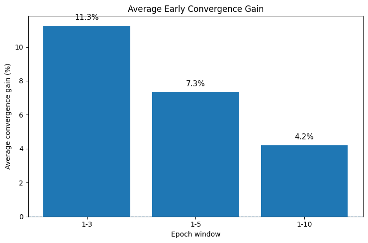
>   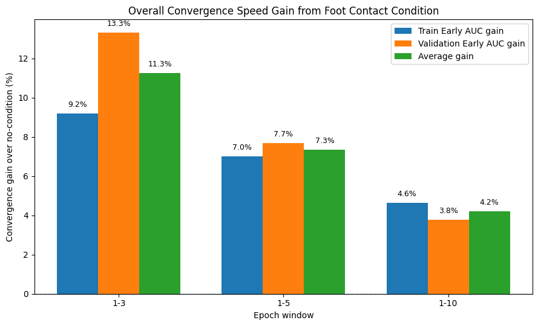
> </p>

<br>

### 🧠 3. Memory
> 
> 계층형 씬그래프 구축 및 장단기 메모리를 활용한 로봇의 동적 환경 인지 결과입니다.
> 
> * #### 방 분리 결과 이미지
> <div style="display: grid; grid-template-columns: repeat(4, 1fr); gap: 10px; align-items: center;">
>   
>   
>   
>   
>   
>   
>   
>   
> </div>
> 
> * #### 3D Scene Graph 동적 업데이트 예시
> 로봇이 Rearrangement Task를 수행함에 따라 동적으로 Scene Graph가 갱신되는 시각화 결과입니다. 빨간색 원으로 표시된 타겟 객체(사과)가 주방(Kitchen)에서 거실(Living Room)의 커피 테이블로 이동한 것을 확인할 수 있습니다.
> 
> <div style="display: grid; grid-template-columns: repeat(2, 1fr); gap: 10px; text-align: center; margin-top: 15px;">
>   <div>
>     <strong>Before (주방에 위치한 사과)</strong>
>     
>   </div>
>   <div>
>     <strong>After (거실 커피 테이블로 이동한 사과)</strong>
>     
>   </div>
> </div>
> 
> * #### Task 수행 동영상
> <iframe width="100%" height="450" src="https://www.youtube.com/embed/n9BuyLzmbgs" title="YouTube video player" frameborder="0" allow="accelerometer; autoplay; clipboard-write; encrypted-media; gyroscope; picture-in-picture; web-share" allowfullscreen></iframe>

### 🤲 4. Tactile
> 
> RGB-Pose 데이터를 바탕으로 실시간 3D 환경을 렌더링한 Continual Gaussian Splatting 매핑 결과입니다.
> * **TF를 이용한 실시간 카메라 Pose 추정 시각화 결과**
>   
<br>

### 🤖 5. Task Execution
> 
> #### 📦 SceneUpdate — Isaac Sim 시뮬레이션 기반 빈공간 씬그래프 & Task Planning
> Isaac Sim 환경에서 Depth 기반 실시간 빈공간 추정을 씬그래프에 통합하고, LLM planner로 pick-and-place 태스크를 수행합니다.
>
> * **freespace 씬그래프 시각화**<br>
> 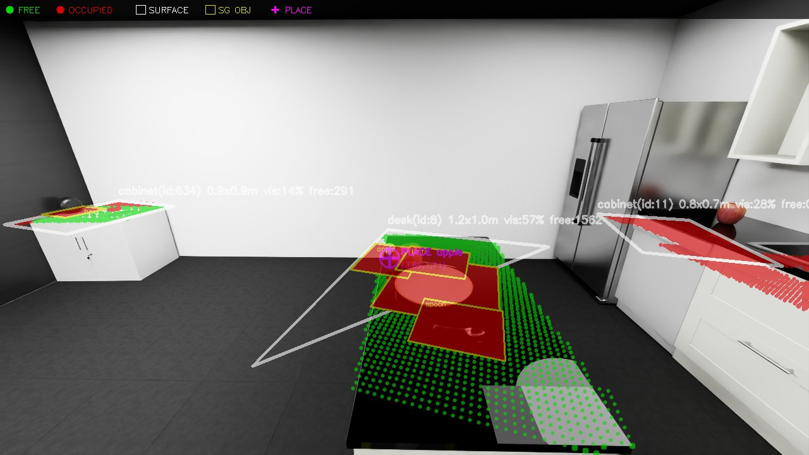
>
> * **isaacsim 에서의 빈공간 추론을 활용한 task execution**<br>
> <video width="100%" controls>
>   <source src="./assets/sceneupdate/task_execution.webm" type="video/webm">
>   Your browser does not support the video tag.
> </video>
>
> <br>
>
> #### 🧪 FreeSpace Pipeline — VLM 파인튜닝을 위한 빈공간 데이터 생성 파이프라인
> SceneUpdate에서 확인한 Depth 기반 방식의 실환경 노이즈 한계를 극복하기 위해, VLM이 빈공간을 직접 추론하도록 파인튜닝하는 파이프라인입니다.<br>
> RoboSpatial 논문을 참조하여 GraspNet / HOPE / SUN RGB-D 데이터셋으로부터 freespace QA를 자동 생성하고, Qwen2-VL-7B를 LoRA로 파인튜닝합니다.
>
> * **학습용 데이터셋 자동 생성 결과** — Depth Map 기반 테이블 표면 추출 및 물체 OBB 차감으로 빈 공간 폴리곤을 자동 라벨링한 예시입니다.<br>
> 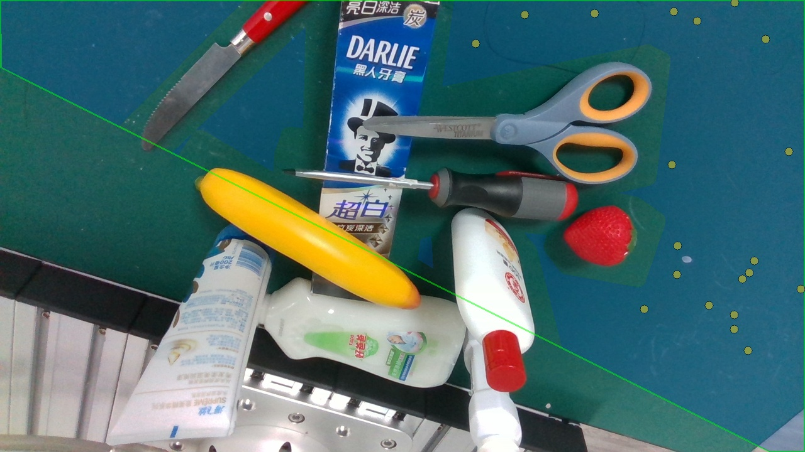
>
> * **Base Model vs Fine-Tuned Model 비교** — 파인튜닝 전(좌)에는 빈공간 폴리곤 출력이 불가능하고 환각(Hallucination)이 발생하지만, LoRA 파인튜닝 후(우)에는 정확한 좌표 폴리곤으로 빈공간을 추론합니다.<br>
> 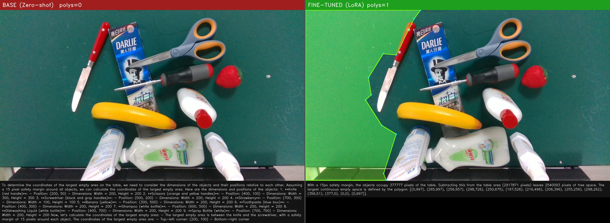

---

## 🚀 Getting Started (사용법)

본 저장소의 각 하위 프로젝트는 서로 다른 연구 주제를 다루고 있어 독립적인 실행 환경과 dependency를 가집니다. 따라서 루트 디렉토리에서 한 번에 실행하지 않고, 필요한 하위 프로젝트 폴더로 이동하여 실행해야 합니다.

---

### 1️⃣ 저장소 Clone
```bash
git clone https://github.com/kookmin-sw/2026-capstone-43.git
cd 2026-capstone-43
```
